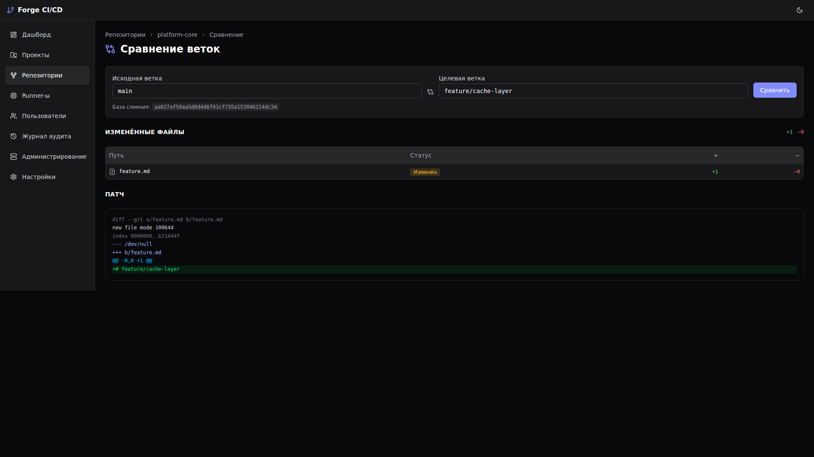
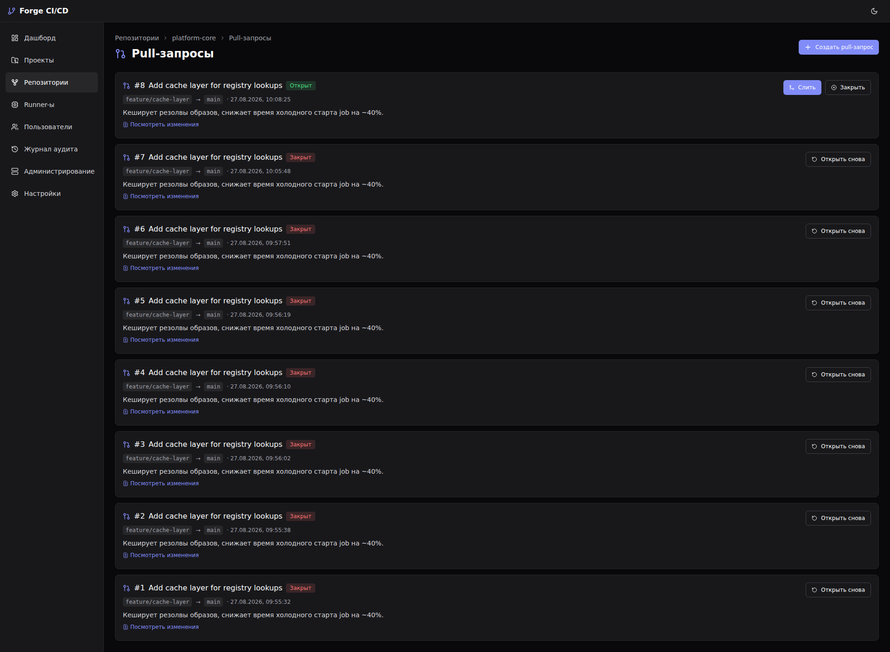
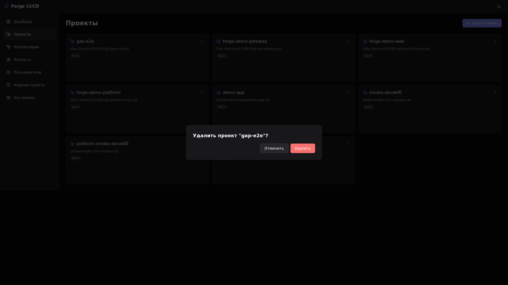
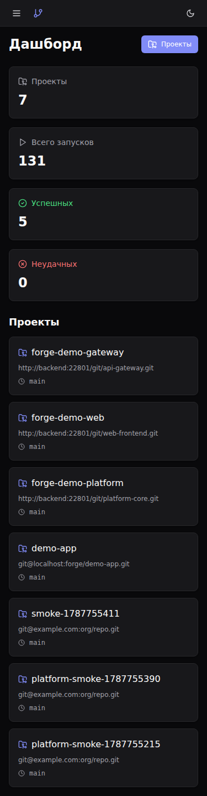
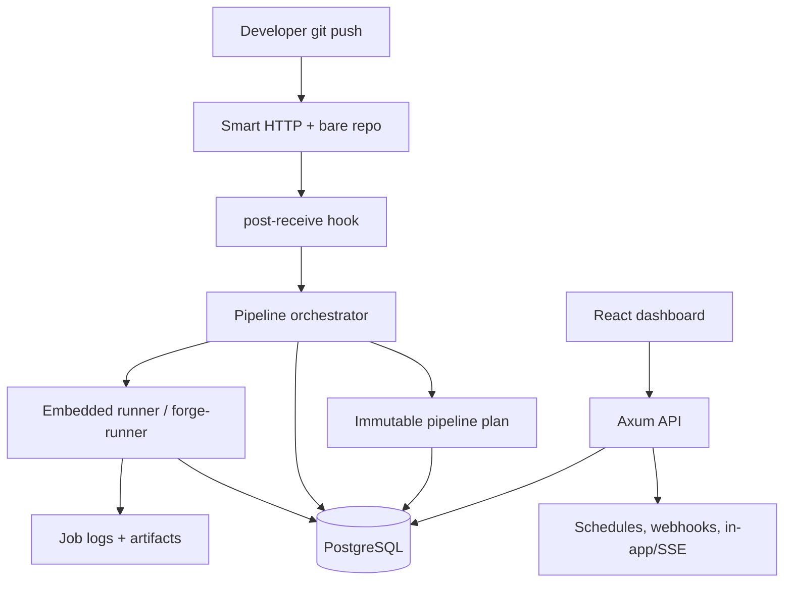

<p align="center">
  
</p>

<p align="center">
  <a href="#features"></a>
  <a href="#stack"></a>
  <a href="#quick-start"></a>
  <a href="#screenshots"></a>
  <a href="#architecture"></a>
  <a href="#quality"></a>
  <a href="#license"></a>
</p>

<p align="center">
  
  
  
  
  
  
  
  
</p>

---

## 🎯 Позиционирование

**Forge CI/CD** — self-hosted control plane для Git-репозиториев и CI/CD: bare Git hosting, Smart HTTP, push-triggered pipelines, Docker/shell jobs, artifacts, secrets, environments, reports, notifications and audit.

Проект находится в стадии **MVP `0.1.x`**. До production hardening его нужно запускать только в trusted network или за reverse proxy.

## 📌 Snapshot

| Поле | Значение |
|---|---|
| Backend | Rust 2024, Axum 0.8, SQLx 0.8 |
| Frontend | React 19, Vite 6, Tailwind CSS 4, shadcn/ui |
| Data | PostgreSQL 17 |
| Runtime | Docker Compose, embedded Docker/shell runner, Git Smart HTTP |
| Ports | Dashboard `22802`, API/Git `22801`, PostgreSQL `22543` on `127.0.0.1` |
| License | FerrPOINT Proprietary Source-Available Evaluation License v1.0 |

<a name="features"></a>
## ✨ Features

| Feature | Статус |
|---|---|
| Projects, pipelines, stages, jobs and bounded logs | Current verified |
| Immutable pipeline plan snapshots | Current verified MVP |
| Bare Git hosting + Smart HTTP + `post-receive` trigger | Current verified |
| Branch/tag browser, compare and pull request flow | Current verified |
| Artifacts up to 50 MiB in local storage | Current verified |
| Secrets encrypted at rest with runner injection and stdout masking | Current verified |
| Environments, deployments, reports and audit trail | Current verified |
| Auth/RBAC with `CICD_AUTH_SECRET` | Current verified |
| Configurable CORS allowlist | Current verified MVP |
| Liveness, DB-aware readiness and Prometheus metrics | Current verified |
| Dependency audit, secret scan and SBOM drift gate | Current verified MVP |
| Schedules, outgoing webhooks, in-app/SSE notifications | MVP |
| External adapters, tenant isolation, distributed runners | Target approved |

| Статус | Значение |
|---|---|
| Current verified | Реализовано и подтверждено тестами, CI, screenshots или runbook evidence. |
| MVP | Работает для bounded local сценариев, без distributed guarantees. |
| Target approved | Принято как целевое требование, но не реализовано полностью. |

<a name="stack"></a>
## 🔧 Core Stack

| Zone | Tech | Роль |
|---|---|---|
| API | Rust + Axum | REST/OpenAPI, Git Smart HTTP, auth/RBAC |
| Persistence | PostgreSQL + SQLx | migrations, queries and runtime state |
| Runner | Embedded Docker/shell executor | local job execution |
| Frontend | React + Vite + Tailwind | dashboard, PRs, code browser and operations UI |
| Docs | contracts, ADR, threat model | source of truth for target behavior |

<a name="quick-start"></a>
## ⚡ Quick Start

```bash
cp .env.example .env
echo "CICD_SECRETS_KEY=$(openssl rand -base64 32)" >> .env
docker compose up --build -d
curl http://127.0.0.1:22801/api/v1/health
curl http://127.0.0.1:22801/api/v1/readiness
```

Dashboard: `http://127.0.0.1:22802`.

Configuration: [docs/ENV.md](docs/ENV.md). CLI: [docs/CLI.md](docs/CLI.md).

```bash
curl -X POST http://127.0.0.1:22801/api/v1/repositories \
  -H 'content-type: application/json' \
  -d '{"name":"my-service"}'

git clone http://127.0.0.1:22802/git/my-service.git
# add .forge-ci.yml, commit, push
git push
```

<a name="screenshots"></a>
## 🖼️ Screenshots

Primary UI evidence is kept in-repo, so the README shows actual product surfaces rather than a decorative mock.

| Surface | Preview |
|---|---|
| Dashboard |  |
| Pipeline detail |  |
| Repository browser |  |
| Branch compare |  |
| Pull requests |  |
| Pull request detail |  |
| Pull request diff |  |
| Project secrets |  |
| Job logs |  |
| Delete confirmation |  |
| Mobile dashboard |  |

Full visual registry: [docs/assets/screens/manifest.md](docs/assets/screens/manifest.md).

<a name="architecture"></a>
## 🏗️ Architecture



## 🧱 Границы доверия

- If `CICD_AUTH_SECRET` is missing or empty, API and Dashboard run in trusted-network mode without auth enforcement.
- With `CICD_AUTH_SECRET`, login/JWT/scoped PAT, session-bound access JWT, refresh rotate/logout/revoke, global roles, project membership RBAC and Git Smart HTTP read/write checks are enforced for linked projects.
- Tenant isolation, service-account tokens, scoped Git credentials and production cookie/CSRF/session-family policy remain target hardening.
- TLS is not bundled; CORS is permissive only when `CICD_CORS_ALLOWED_ORIGINS` is empty for isolated development, and shared deployments must set an explicit allowlist. In-process rate limiting is not a replacement for a reverse proxy or distributed limiter.
- Embedded runner records job ownership in `job_leases`, injects only declared secrets, collects declared artifact files, and reconciles expired leases. The external runner protocol MVP exposes register/heartbeat/bounded long-poll with in-process + PostgreSQL `LISTEN/NOTIFY` wakeup/ack/renew/`secrets:resolve`/artifact upload/logs/complete with bearer runner credentials and lease tokens; `forge-runner` can run as a separate shell runner process, keep active-lease heartbeat while commands run, append stdout/stderr to attempt-owned logs, resolve declared secrets, and upload declared artifacts. The API maintenance loop requeues unacknowledged offers after `ackDeadline`, fails dispatch-eligible queued jobs after configurable queue timeout when no compatible execution path exists, and marks stale online runners offline when no unexpired active lease protects them. Richer log chunks, resumable artifact sessions, Docker/Kubernetes isolation and sandbox hardening remain target work.
- Pipeline trigger stores immutable `pipeline_plans` snapshots for current `legacy-linear` and v1 `jobs.needs` DAG plans; policy diagnostics/job-level dispatch remain target hardening.
- Current CI runs SQLx optional MySQL/RSA feature guard, Rust/Node dependency audits, secret scan and SBOM drift checks; `cargo-deny`, container scan and release SBOM publication remain target hardening.
- Schedules, outgoing webhooks and `in_app`/`sse` notifications work as MVP local delivery.
- Outbox delivery history, attempt log and failed-delivery requeue are bounded MVP features; inbound provider webhooks, external notification adapters and crash-safe distributed delivery guarantees are not complete.

Full current-state cut: [docs/CURRENT_STATE.md](docs/CURRENT_STATE.md). Security policy: [SECURITY.md](SECURITY.md).

<a name="quality"></a>
## 🛡️ Quality Bar

| Проверка | Команда |
|---|---|
| Stack up/down | `just up` / `just down` |
| Health | `just health` |
| Readiness | `just readiness` |
| Backend tests | `just test-backend` |
| Frontend tests | `just test-frontend` |
| Frontend build | `just build-frontend` |
| Secret scan | `python3 scripts/scan_secrets.py` |
| SBOM drift | `python3 scripts/generate_sbom.py --check` |
| Docs verification | `python3 scripts/verify_docs.py --all` |

## 🧰 Commands

| Команда | Описание |
|---|---|
| `just up` / `just down` | Build/start and stop the Docker Compose stack |
| `just health` | API health check |
| `just readiness` | DB and migration readiness check |
| `just test-backend` | Backend unit and contract tests through the pinned Rust image |
| `just test-frontend` | Frontend Vitest suite |
| `just build-frontend` | Production frontend build |
| `python3 scripts/scan_secrets.py` | Fail on committed token/key/password patterns in repository text |
| `python3 scripts/generate_sbom.py --check` | Verify committed SBOM inventory is in sync |
| `python3 scripts/verify_docs.py --all` | Documentation links, canonical statuses and docs integrity |

## 🧭 Project Map

```text
CI-CD/
├── backend/           # Rust workspace: API, domain, CLI, Git hosting, runner, store
├── frontend/          # React dashboard with generated API hooks
├── docs/              # architecture, contracts, operations, quality, screenshots
├── scripts/           # documentation and verification helpers
├── docker-compose.yml # postgres + backend + frontend
└── justfile           # local workflow commands
```

## 📚 Документы

| Аудитория | Документы |
|---|---|
| Overview | [docs/README.md](docs/README.md), [docs/CURRENT_STATE.md](docs/CURRENT_STATE.md), [docs/ROADMAP.md](docs/ROADMAP.md) |
| User/owner | [docs/USER_GUIDE.md](docs/USER_GUIDE.md), [docs/PRODUCT_REQUIREMENTS.md](docs/PRODUCT_REQUIREMENTS.md) |
| Developer | [docs/DEVELOPMENT_GUIDE.md](docs/DEVELOPMENT_GUIDE.md), [docs/API.md](docs/API.md), [docs/DATA_MODEL.md](docs/DATA_MODEL.md), [docs/ENV.md](docs/ENV.md), [docs/CLI.md](docs/CLI.md), [docs/LIBRARIES.md](docs/LIBRARIES.md) |
| Operator | [docs/OPERATIONS.md](docs/OPERATIONS.md), [docs/TROUBLESHOOTING.md](docs/TROUBLESHOOTING.md), [docs/SLO.md](docs/SLO.md), [docs/METRICS.md](docs/METRICS.md), [docs/DISASTER_RECOVERY.md](docs/DISASTER_RECOVERY.md), [docs/INCIDENT_RESPONSE.md](docs/INCIDENT_RESPONSE.md) |
| Architecture | [docs/ARCHITECTURE_INDEX.md](docs/ARCHITECTURE_INDEX.md), [docs/ARCHITECTURE.md](docs/ARCHITECTURE.md), [docs/FUNCTIONAL_ARCHITECTURE.md](docs/FUNCTIONAL_ARCHITECTURE.md), [docs/AUTHORIZATION.md](docs/AUTHORIZATION.md), [docs/RUNNER_ARCHITECTURE.md](docs/RUNNER_ARCHITECTURE.md), [docs/AUTOMATION_ARCHITECTURE.md](docs/AUTOMATION_ARCHITECTURE.md), [docs/STORAGE_ARCHITECTURE.md](docs/STORAGE_ARCHITECTURE.md), [docs/DELIVERY_ARCHITECTURE.md](docs/DELIVERY_ARCHITECTURE.md), [docs/ADR.md](docs/ADR.md), [docs/contracts](docs/contracts), [docs/architecture](docs/architecture) |
| Executable specs | [docs/IMPLEMENTATION_CONTRACTS.md](docs/IMPLEMENTATION_CONTRACTS.md), [docs/MIGRATION_EXECUTION_SPEC.md](docs/MIGRATION_EXECUTION_SPEC.md), [docs/AUTH_IMPLEMENTATION_SPEC.md](docs/AUTH_IMPLEMENTATION_SPEC.md), [docs/EXECUTION_AUTOMATION_IMPLEMENTATION_SPEC.md](docs/EXECUTION_AUTOMATION_IMPLEMENTATION_SPEC.md) |
| Quality/security | [docs/TEST_PLAN.md](docs/TEST_PLAN.md), [docs/TRACEABILITY.md](docs/TRACEABILITY.md), [docs/THREAT_MODEL.md](docs/THREAT_MODEL.md), [docs/RISK_REGISTER.md](docs/RISK_REGISTER.md), [docs/ACCESSIBILITY.md](docs/ACCESSIBILITY.md), [docs/THIRD_PARTY.md](docs/THIRD_PARTY.md), [SECURITY.md](SECURITY.md) |
| Policy | [CONTRIBUTING.md](CONTRIBUTING.md), [SUPPORT.md](SUPPORT.md), [CHANGELOG.md](CHANGELOG.md), [LICENSE](LICENSE) |

<a name="license"></a>
## 🔒 License

Proprietary source-available. Not open source.

Viewing/evaluation only.

Commercial, production, resale, redistribution, SaaS/hosting use require written license from FerrPOINT. См. [LICENSE](LICENSE), [NOTICE](NOTICE) и [THIRD_PARTY_NOTICES.md](THIRD_PARTY_NOTICES.md).
