# Forge CI/CD

Self-hosted control plane для Git-репозиториев и CI/CD: Rust (Axum + SQLx + PostgreSQL) + React (Vite + Tailwind). Env-префикс `CICD_`.

Forge CI/CD хранит bare Git-репозитории, отдаёт Smart HTTP для `clone` / `fetch` / `push`, автоматически создаёт пайплайны на `post-receive` и показывает их ход в Dashboard.

## Скриншоты

### Вход


### Дашборд


### Проекты


### Git-репозитории

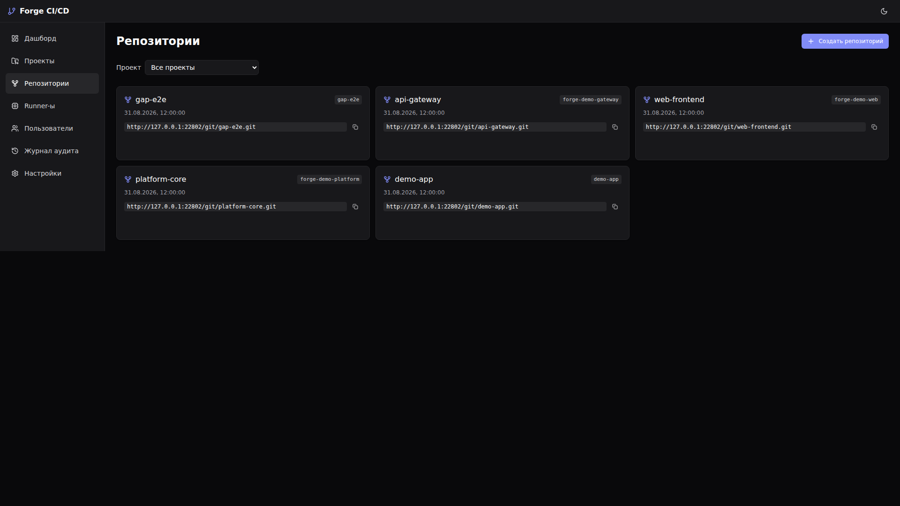

### Пайплайны


### Детали пайплайна


### Настройки

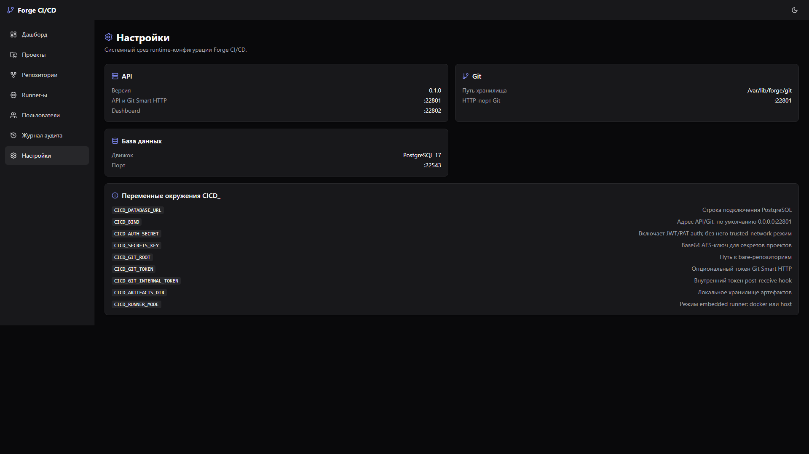

### Администрирование

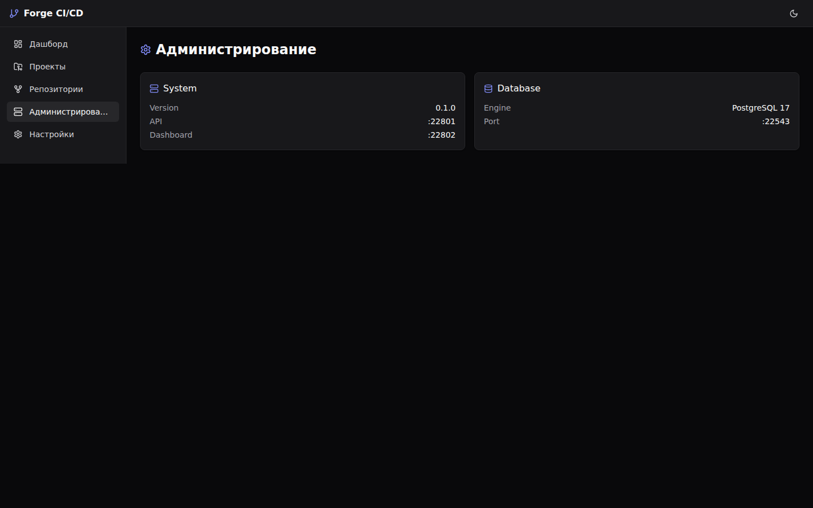

### Репозиторий: коммиты и ветки


### Сравнение веток


### Pull-запросы


### Репозитории (фильтр)

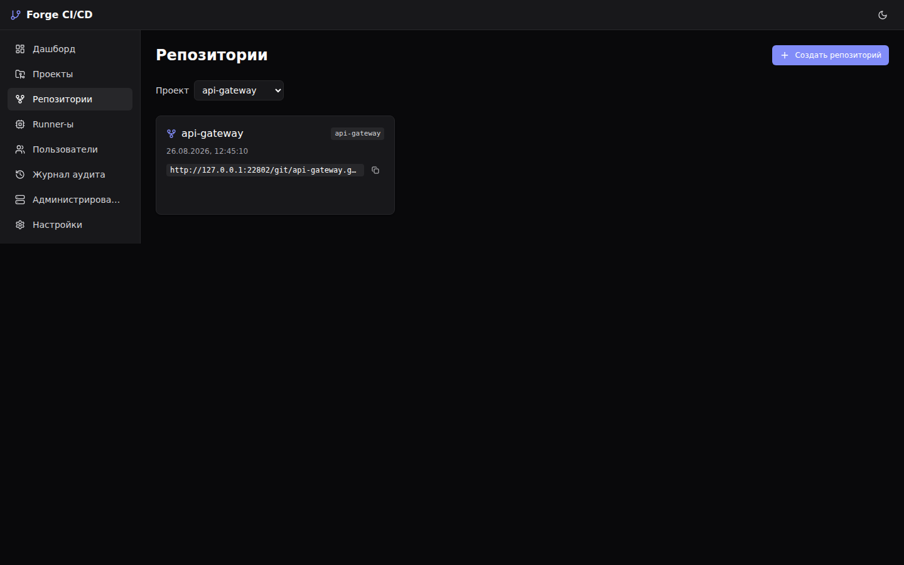

### Runners

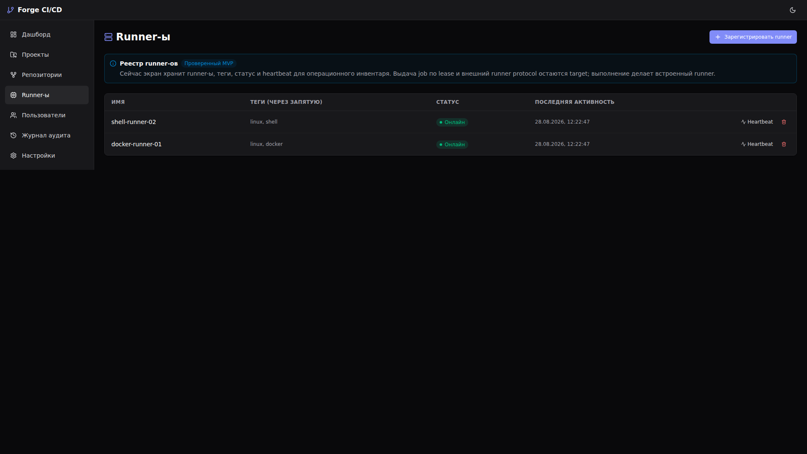

### Секреты проекта


### Артефакты


### Окружения

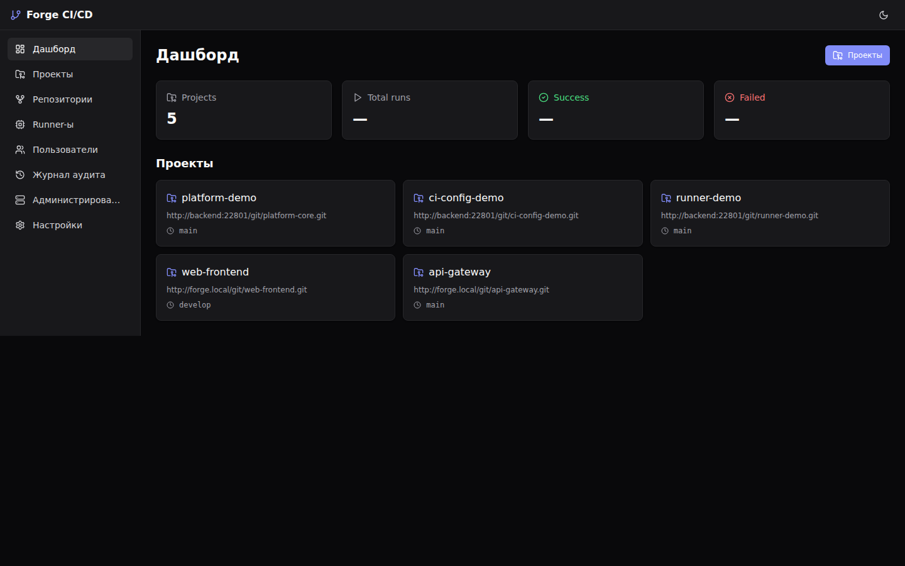

### Расписания


### Webhooks и уведомления

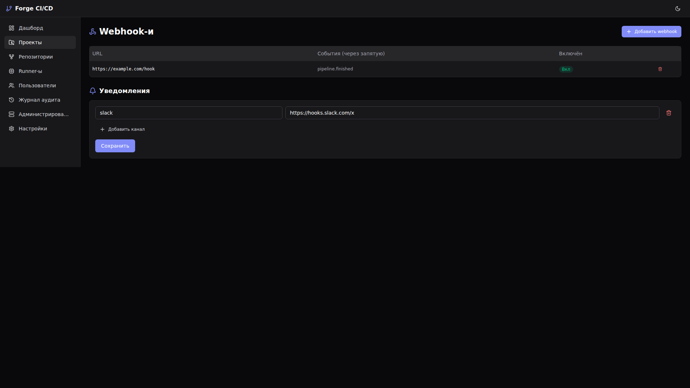

### Отчёты

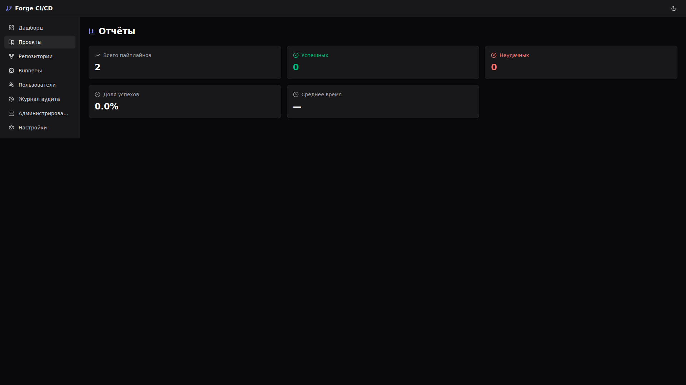

### Журнал аудита

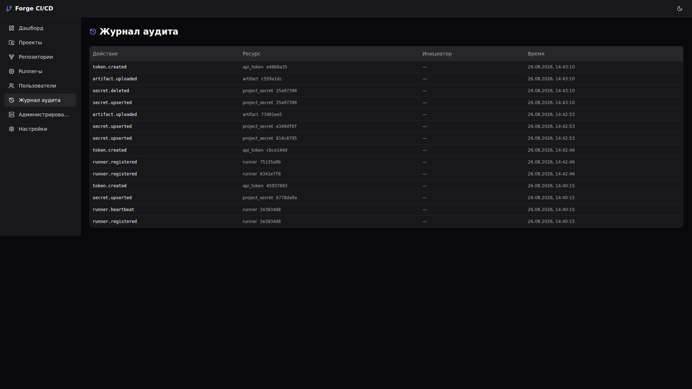

### Пользователи и API-токены

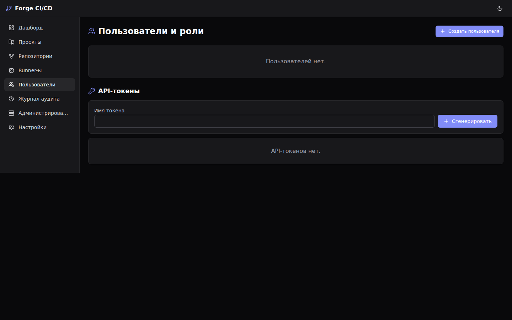

### Мобильная версия

Дашборд (375×812):


Проекты:

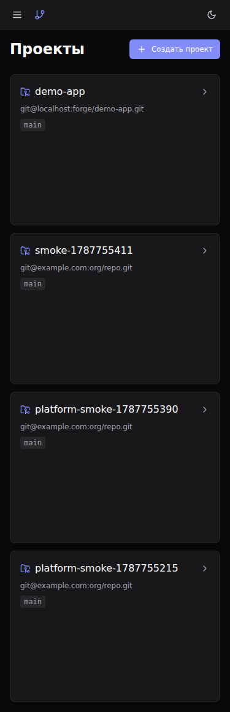

Детали пайплайна:

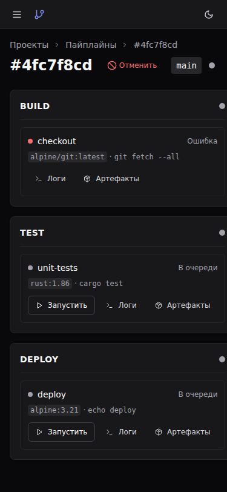

Runners:

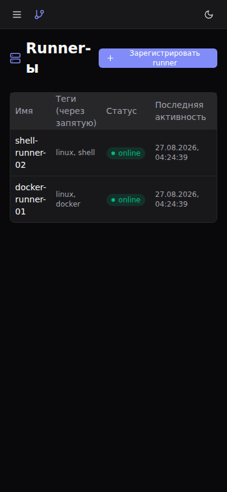

> Мобильный layout работоспособен, но широкие таблицы (runners) тесноваты на 375px — адаптация таблиц в mobile-режиме в целевой архитектуре (`docs/DELIVERY_ARCHITECTURE.md`).

## Порты по умолчанию

| Сервис | Внешний порт | Описание |
|---|---:|---|
| Dashboard | `22802` | Nginx со статическим React SPA и proxy `/api` / `/git` |
| API + Git Smart HTTP | `22801` | REST API, Git clone/fetch/push, internal hooks |
| PostgreSQL | `22543` | Основная БД |

## Функциональность

### Git-хостинг

- Создание и удаление bare Git-репозиториев через Dashboard и REST API
- Git Smart HTTP: `git clone`, `git fetch`, `git push`
- Хранилище репозиториев в Docker volume `cicd_git_repos`
- Опциональная защита Git-трафика через `CICD_GIT_TOKEN` (Basic auth или `x-git-token`)
- `post-receive` hook создаётся автоматически и запускает пайплайн на push

### Просмотр репозитория и код-ревью

- Repository browser: коммиты и ветки репозитория в Dashboard
- Compare: diff между ветками — merge-base, изменённые файлы, добавления/удаления, patch
- Pull requests: создание, список, merge (через `git merge-tree` без worktree), close и reopen
- Merge создаёт настоящий merge-commit в bare-репозитории и обновляет refs

### Runner и CI/CD выполнение

- Embedded runner: реальное выполнение команд джоб (Docker или shell), клонирование репо, стриминг логов
- `.forge-ci.yml` из репозитория: кастомные stages/jobs (fallback на дефолтный шаблон)
- Cancel/Retry для пайплайнов и отдельных джоб (с kill процесса)
- Stop-on-failure: каскадная отмена последующих стадий
- Runners registry: регистрация, heartbeat (online/offline/paused), теги, удаление

### Платформа (MVP)

- **Project Secrets**: encrypted-at-rest (AES-256-GCM, `CICD_SECRETS_KEY`), значения никогда не возвращаются через API
- **Artifacts**: метаданные, upload (raw body) / download, локальное хранилище (`CICD_ARTIFACTS_DIR`, 50 MiB лимит)
- **Environments & Deployments**: создание окружений (available/stopped/degraded) и запись деплоев
- **Schedules**: cron-выражение + project/ref (хранение и API; execution scheduler — TODO)
- **Webhooks**: конфигурация исходящих webhook-ов (url, events, enabled; доставка — TODO)
- **Notifications**: конфигурация каналов уведомлений (slack/email/…; доставка — TODO)
- **Reports**: success rate, average duration по проекту
- **Audit Log**: последние 200 событий (runner, secret, artifact, token операции)
- **Users & Roles**: модель пользователей с ролями admin/maintainer/developer/viewer (auth enforcement — TODO)
- **API Tokens**: генерация (SHA-256 hash, одноразовый показ значения) и отзыв (проверка токенов — TODO)

```bash
# Создать репозиторий
curl -X POST http://127.0.0.1:22801/api/v1/repositories \
  -H 'content-type: application/json' \
  -d '{"name":"my-service"}'

# Клонировать и пушить
git clone http://127.0.0.1:22802/git/my-service.git
```

### Проекты и пайплайны

- Проекты: создание, редактирование, удаление с каскадным удалением пайплайнов
- Привязка проекта к URL Git-репозитория и default branch
- Ручной запуск пайплайна по любому `git_ref`
- Автозапуск после Git push, если `repository_url` проекта указывает на локальный репозиторий
- Шаблон пайплайна: `build` -> `test` -> `deploy`
- Статусы: `queued` -> `running` -> `success` / `failed` / `canceled`
- Агрегация статусов job -> stage -> pipeline

### Jobs и логи

- Управление статусами джоб из Dashboard и REST API
- Append-only логи с последовательной нумерацией
- Pipeline Detail: стадии, джобы, команды, Docker images и live-like log panel

### Dashboard и администрирование

- Dashboard с проектами и показателями CI/CD
- Страницы: Projects, Repositories, Pipelines, Pipeline Detail, Runners, Secrets, Artifacts, Environments, Schedules, Webhooks, Reports, Audit Log, Users, Settings, Admin
- Три темы: `dark`, `gray`, `light`
- Локализация `ru` / `en`, язык по умолчанию — русский
- REST API с JSON error envelope и health-check

## Быстрый старт

```bash
# 1. Скопировать конфигурацию
cp .env.example .env

# 2. Сгенерировать ключ для шифрования секретов (обязательно для secrets)
echo "CICD_SECRETS_KEY=$(openssl rand -base64 32)" >> .env

# 3. Поднять весь стек
# Docker создаст PostgreSQL, backend и frontend
docker compose up --build -d

# 4. Проверить сервисы
curl http://127.0.0.1:22801/api/v1/health
# {"service":"cicd","status":"ok"}

# 5. Открыть Dashboard
# http://127.0.0.1:22802
```

## Конфигурация

| Переменная | Default | Назначение |
|---|---|---|
| `CICD_API_PORT` | `22801` | Внешний порт API / Smart HTTP |
| `CICD_WEB_PORT` | `22802` | Внешний порт Dashboard |
| `CICD_DATABASE_PORT` | `22543` | Внешний порт PostgreSQL |
| `CICD_DATABASE_USER` | `cicd` | Пользователь PostgreSQL |
| `CICD_DATABASE_PASSWORD` | `cicd_local_only` | Пароль PostgreSQL только для local dev |
| `CICD_DATABASE_NAME` | `cicd` | Имя БД |
| `CICD_GIT_ROOT` | `/var/lib/forge/git` | Путь к bare-репозиториям внутри backend container |
| `CICD_GIT_TOKEN` | пусто | Токен Git Smart HTTP; пустой = local dev без auth |
| `CICD_GIT_INTERNAL_TOKEN` | dev token | Токен вызова post-receive -> pipeline hook |
| `CICD_SECRETS_KEY` | пусто | Base64 32-byte ключ для AES-256-GCM шифрования секретов |
| `CICD_ARTIFACTS_DIR` | `/var/lib/forge/artifacts` | Директория локального хранилища артефактов |

Не используйте дефолтные секреты вне локальной разработки.

## CLI

```bash
# Собрать CLI
cd backend
cargo build --bin cicd-cli

# Настроить API URL
export CICD_API_URL=http://localhost:22801

# Проекты
./target/debug/cicd-cli project list
./target/debug/cicd-cli project create \
  --name my-service \
  --repository-url http://127.0.0.1:22802/git/my-service.git

# Пайплайны
./target/debug/cicd-cli pipeline list --project <PROJECT_UUID>
./target/debug/cicd-cli pipeline run --project <PROJECT_UUID> --ref main
./target/debug/cicd-cli pipeline show --pipeline <PIPELINE_UUID>

# Джобы и логи
./target/debug/cicd-cli job start --job <JOB_UUID>
./target/debug/cicd-cli job logs --job <JOB_UUID>
```

Подробности: [docs/CLI.md](docs/CLI.md).

## Команды

Основные операции доступны в `justfile`:

| Команда | Описание |
|---|---|
| `just up` | Собрать и запустить Docker Compose стек |
| `just down` | Остановить контейнеры |
| `just health` | Проверить API health-check |
| `just test-backend` | Backend unit и contract tests |
| `just test-frontend` | Frontend Vitest tests |
| `just build-frontend` | Production build frontend |

Либо напрямую:

```bash
# Backend checks через Rust image
cd backend
docker run --rm --entrypoint /bin/bash -v "$PWD:/workspace" -w /workspace rust:1.86-bookworm \
  -lc '/usr/local/cargo/bin/cargo test'

# Frontend
cd ../frontend
pnpm install
pnpm test
pnpm build
```

## Структура

```text
CI-CD/
├── backend/                 # Rust Axum API, domain, SQLx store, CLI, Git Smart HTTP
│   └── src/
│       ├── api.rs           # REST routes, pipeline/job orchestration
│       ├── domain.rs        # Status transition rules
│       ├── git_host.rs      # Bare repositories + Smart HTTP + post-receive hook
│       ├── platform.rs      # Platform APIs: runners, secrets, artifacts, environments,
│       │                    #   schedules, webhooks, notifications, reports, audit, users, tokens
│       ├── runner.rs        # Embedded runner: Docker/shell execution, supervisor loop
│       ├── store.rs         # PostgreSQL schema bootstrap (migrate)
│       └── bin/cicd-cli.rs  # CLI client
├── frontend/                # React SPA (pages, widgets, typed API hooks)
├── docs/                    # Architecture, API, operations, roadmap and ADRs
│   └── screenshots/         # Dashboard screenshots used in this README
├── docker-compose.yml       # PostgreSQL + backend + frontend
├── justfile                 # Unified local commands
└── AGENTS.md                # Rules for AI coding agents
```

## Документы

- [Техническое задание](docs/TZ.md)
- [Индекс архитектуры](docs/ARCHITECTURE_INDEX.md) — входная точка: карта контекстов, current vs target
- [Функциональная архитектура](docs/FUNCTIONAL_ARCHITECTURE.md) — capability map, ownership, инварианты
- [Архитектура](docs/ARCHITECTURE.md)
- [Дата-модель](docs/DATA_MODEL.md)
- [Доменная модель](docs/DOMAIN_MODEL.md)
- [API](docs/API.md)
- [Git-хостинг](docs/GIT_HOSTING.md)
- [Pull requests и сравнение](docs/PULL_REQUESTS.md)
- [Secrets management](docs/SECRETS_MGMT.md)
- [Artifacts](docs/ARTIFACTS.md)
- [Webhooks](docs/WEBHOOKS.md)
- [Notifications](docs/NOTIFICATIONS.md)
- [Reports](docs/REPORTS.md)
- [Деплой](docs/DEPLOYMENT.md)
- [Локальный запуск](docs/LOCAL_SETUP.md)
- [Безопасность](docs/SECURITY.md)
- [Тестирование](docs/TESTING.md)
- [Roadmap](docs/ROADMAP.md)
- [Runbook](docs/OPS_RUNBOOK.md)
- [Правила для агентов](AGENTS.md)

Полный индекс: [`docs/`](docs/).

## Roadmap

- [x] MVP control plane: проекты, пайплайны, стадии, джобы, логи
- [x] Встроенный Git Smart HTTP + post-receive auto-trigger
- [x] Repository browser, compare, pull requests с merge
- [x] Runners: регистрация, список, heartbeat
- [x] Project secrets: encrypted-at-rest (AES-256-GCM), без возврата значений
- [x] Artifacts: метаданные, upload/download, локальное хранилище
- [x] Environments & deployments
- [x] Schedules: cron-выражение + project/ref, хранение и API
- [x] Webhooks config + notifications config
- [x] Reports: success rate, average duration
- [x] Audit log
- [x] Users & roles model + API tokens
- [ ] Auth и RBAC enforcement
- [ ] Реальные Docker runners
- [ ] Webhook delivery и SSE events
- [ ] Cron-scheduler execution
- [ ] Secret injection в runner окружение

## Лицензия

MIT.
