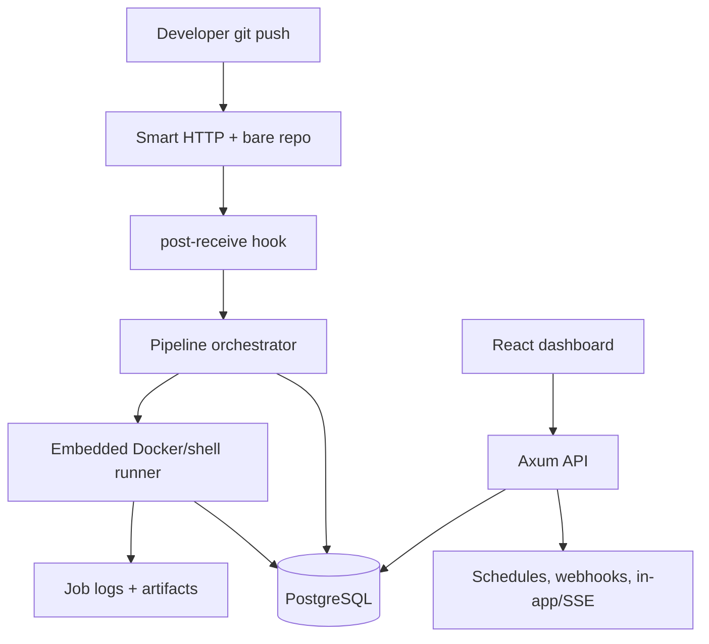

<p align="center">
  
</p>

<p align="center">
  <a href="#features"></a>
  <a href="#stack"></a>
  <a href="#quick-start"></a>
  <a href="#architecture"></a>
  <a href="#quality"></a>
  <a href="#license"></a>
</p>

<p align="center">
  
  
  
  
  
  
  
  
</p>

---

## 🎯 Позиционирование

**Forge CI/CD** — self-hosted control plane для Git-репозиториев и CI/CD: bare Git hosting, Smart HTTP, push-triggered pipelines, Docker/shell jobs, artifacts, secrets, environments, reports, notifications and audit.

Проект находится в стадии **MVP `0.1.x`**. До production hardening его нужно запускать только в trusted network или за reverse proxy.

## 📌 Snapshot

| Поле | Значение |
|---|---|
| Backend | Rust 2024, Axum 0.8, SQLx 0.8 |
| Frontend | React 19, Vite 6, Tailwind CSS 4, shadcn/ui |
| Data | PostgreSQL 17 |
| Runtime | Docker Compose, embedded Docker/shell runner, Git Smart HTTP |
| Ports | Dashboard `22802`, API/Git `22801`, PostgreSQL `22543` on `127.0.0.1` |
| License | FerrPOINT Proprietary Source-Available Evaluation License v1.0 |

<a name="features"></a>
## ✨ Features

| Feature | Статус |
|---|---|
| Projects, pipelines, stages, jobs and bounded logs | Current verified |
| Bare Git hosting + Smart HTTP + `post-receive` trigger | Current verified |
| Branch/tag browser, compare and pull request flow | Current verified |
| Artifacts up to 50 MiB in local storage | Current verified |
| Secrets encrypted at rest with runner injection and stdout masking | Current verified |
| Environments, deployments, reports and audit trail | Current verified |
| Auth/RBAC with `CICD_AUTH_SECRET` | Current verified |
| Schedules, outgoing webhooks, in-app/SSE notifications | MVP |
| External adapters, tenant isolation, distributed runners | Target approved |

| Статус | Значение |
|---|---|
| Current verified | Реализовано и подтверждено тестами, CI, screenshots или runbook evidence. |
| MVP | Работает для bounded local сценариев, без distributed guarantees. |
| Target approved | Принято как целевое требование, но не реализовано полностью. |

<a name="stack"></a>
## 🔧 Core Stack

| Zone | Tech | Роль |
|---|---|---|
| API | Rust + Axum | REST/OpenAPI, Git Smart HTTP, auth/RBAC |
| Persistence | PostgreSQL + SQLx | migrations, queries and runtime state |
| Runner | Embedded Docker/shell executor | local job execution |
| Frontend | React + Vite + Tailwind | dashboard, PRs, code browser and operations UI |
| Docs | contracts, ADR, threat model | source of truth for target behavior |

<a name="quick-start"></a>
## ⚡ Quick Start

```bash
cp .env.example .env
echo "CICD_SECRETS_KEY=$(openssl rand -base64 32)" >> .env
docker compose up --build -d
curl http://127.0.0.1:22801/api/v1/health
```

Dashboard: `http://127.0.0.1:22802`.

```bash
curl -X POST http://127.0.0.1:22801/api/v1/repositories \
  -H 'content-type: application/json' \
  -d '{"name":"my-service"}'

git clone http://127.0.0.1:22802/git/my-service.git
# add .forge-ci.yml, commit, push
git push
```

<a name="architecture"></a>
## 🏗️ Architecture



## 🧱 Границы доверия

- Without `CICD_AUTH_SECRET`, API and Dashboard run in trusted-network mode.
- TLS, distributed rate limiting, tenant isolation, service-account tokens, scoped Git credentials and production cookie/CSRF/session-family policy are hardening tasks.
- Scheduler/outbox supports MVP scenarios but does not claim crash-safe distributed delivery guarantees.

Full current-state cut: [docs/CURRENT_STATE.md](docs/CURRENT_STATE.md). Security policy: [SECURITY.md](SECURITY.md).

<a name="quality"></a>
## 🛡️ Quality Bar

| Проверка | Команда |
|---|---|
| Stack up/down | `just up` / `just down` |
| Health | `just health` |
| Backend tests | `just test-backend` |
| Frontend tests | `just test-frontend` |
| Frontend build | `just build-frontend` |
| Docs verification | `python3 scripts/verify_docs.py --all` |

## 🧭 Project Map

```text
CI-CD/
├── backend/           # Rust workspace: API, domain, CLI, Git hosting, runner, store
├── frontend/          # React dashboard with generated API hooks
├── docs/              # architecture, contracts, operations, quality, screenshots
├── scripts/           # documentation and verification helpers
├── docker-compose.yml # postgres + backend + frontend
└── justfile           # local workflow commands
```

## 📚 Документы

- [docs/README.md](docs/README.md) — documentation map.
- [docs/USER_GUIDE.md](docs/USER_GUIDE.md) — user workflows.
- [docs/DEVELOPMENT_GUIDE.md](docs/DEVELOPMENT_GUIDE.md) — development.
- [docs/OPERATIONS.md](docs/OPERATIONS.md), [docs/TROUBLESHOOTING.md](docs/TROUBLESHOOTING.md) — operations.
- [docs/ARCHITECTURE_INDEX.md](docs/ARCHITECTURE_INDEX.md), [docs/contracts](docs/contracts), [docs/ADR.md](docs/ADR.md) — architecture and contracts.
- [docs/TEST_PLAN.md](docs/TEST_PLAN.md), [docs/TRACEABILITY.md](docs/TRACEABILITY.md), [docs/THREAT_MODEL.md](docs/THREAT_MODEL.md) — quality and security.

Screenshots live in [docs/assets/screens/manifest.md](docs/assets/screens/manifest.md).

<a name="license"></a>
## 🔒 License

Proprietary source-available. Not open source.

Viewing/evaluation only.

Commercial, production, resale, redistribution, SaaS/hosting use require written license from FerrPOINT. См. [LICENSE](LICENSE), [NOTICE](NOTICE) и [THIRD_PARTY_NOTICES.md](THIRD_PARTY_NOTICES.md).
