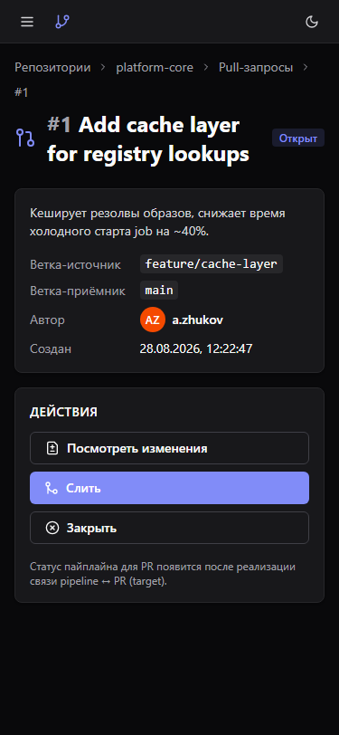
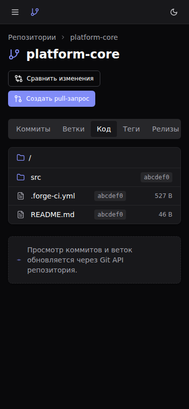
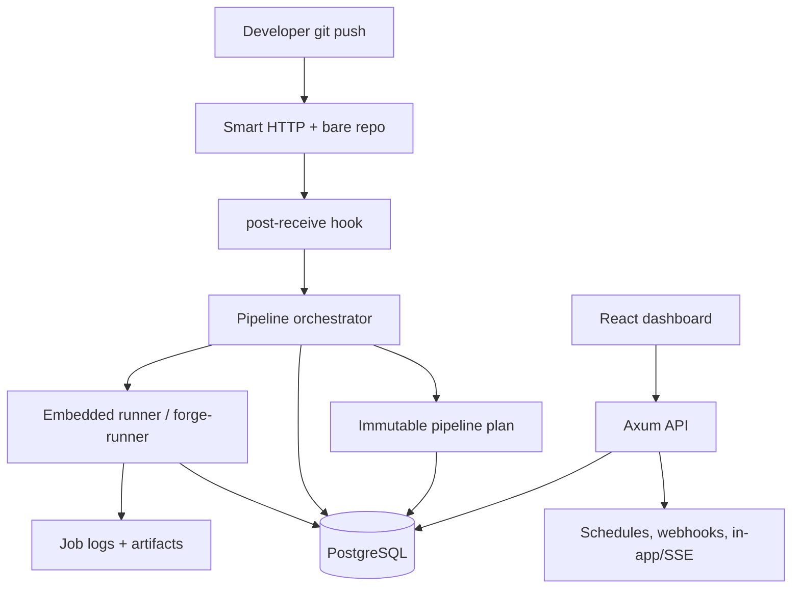

<p align="center">
  
</p>

<p align="center">
  <a href="#overview"></a>
  <a href="#capabilities"></a>
  <a href="#quick-start"></a>
  <a href="#visual-proof"></a>
  <a href="#safety"></a>
  <a href="#quality"></a>
</p>

<p align="center">
  
  
  
  
  
  
  
  
</p>

---

> **Forge CI/CD** — self-hosted control plane для Git-репозиториев и CI/CD: bare Git hosting, Smart HTTP, push-triggered pipelines, Docker/shell jobs, artifacts, secrets, environments, reports, notifications и audit. Проект в стадии **MVP `0.1.x`**: до production hardening запускать только в trusted network или за reverse proxy.

<a name="overview"></a>

## Обзор и Snapshot

| Поле | Значение |
|---|---|
| Backend | Rust 2024, Axum 0.8, SQLx 0.8 |
| Frontend | React 19, Vite 6, Tailwind CSS 4, shadcn/ui |
| Data | PostgreSQL 17 |
| Runtime | Docker Compose, embedded Docker/shell runner, Git Smart HTTP |
| Порты | repository-local: dashboard/Git proxy `22802`, API/direct Git `22801`, PostgreSQL `22543` (loopback); Base umbrella: dashboard `7712`, API `7711` |
| License | FerrPOINT Proprietary Source-Available Evaluation License v1.0 |

<a name="capabilities"></a>

## Возможности

| Feature | Статус |
|---|---|
| Projects, pipelines, stages, jobs и bounded logs | Current verified |
| Immutable pipeline plan snapshots | Current verified MVP |
| Bare Git hosting + Smart HTTP + `post-receive` trigger | Current verified |
| Branch/tag browser, compare и pull request flow | Current verified |
| Artifacts до 50 MiB в local storage с SHA-256 и retention cleanup | Current verified MVP |
| Secrets encrypted at rest с runner injection и stdout masking | Current verified |
| Environments, protected approvals, rollback records, reports и audit trail | Current verified MVP |
| HTTP-only CLI для runtime и platform operations | Current verified MVP |
| Auth/RBAC с `CICD_AUTH_SECRET` | Current verified |
| Configurable CORS allowlist | Current verified MVP |
| Liveness, DB-aware readiness и Prometheus metrics | Current verified |
| Dependency audit, secret scan и SBOM drift gate | Current verified MVP |
| Browser E2E и all-route axe smoke на реальном Compose stack | Current verified MVP |
| RU/EN Dashboard i18n contract parity и динамические status/action keys | Current verified MVP |
| Seeded API/Dashboard performance smoke budgets | Current verified MVP |
| Schedules, outgoing webhooks, in-app/SSE notifications | MVP |
| External adapters, tenant isolation, distributed runners | Target approved |

| Статус | Значение |
|---|---|
| Current verified | Реализовано и подтверждено тестами, CI, screenshots или runbook evidence. |
| MVP | Работает для bounded local сценариев, без distributed guarantees. |
| Target approved | Принято как целевое требование, но не реализовано полностью. |

<a name="quick-start"></a>

## Быстрый старт

```bash
cp .env.example .env
echo "CICD_SECRETS_KEY=$(openssl rand -base64 32)" >> .env
docker compose up --build -d
curl -fsS http://127.0.0.1:22801/api/v1/health
curl -fsS http://127.0.0.1:22801/api/v1/readiness
```

Dashboard: `http://127.0.0.1:22802`.

```bash
curl -X POST http://127.0.0.1:22801/api/v1/repositories \
  -H 'content-type: application/json' \
  -d '{"name":"my-service"}'

git clone http://127.0.0.1:22802/git/my-service.git
# добавить .forge-ci.yml, commit, push через Dashboard/Git proxy
git push
```

Configuration: [docs/ENV.md](docs/ENV.md). CLI: [docs/CLI.md](docs/CLI.md).

<a name="visual-proof"></a>

## Визуальные доказательства

Скриншоты — реальные поверхности Dashboard с seeded-данными.

### Вход


### Дашборд


### Проекты


### Пайплайны


### Детали пайплайна


### Код репозитория


### Сравнение веток


### Pull-запросы


### Детали pull-запроса


### Diff конкретного pull-запроса


### Секреты проекта


### Раннеры


### Окружения


### Артефакты


### Логи джоба


### Аудит


### Подтверждение удаления проекта


### Мобильный интерфейс (375×812)

 

 

 

На `375x812` плотные метаданные пайплайна остаются намеренно компактными; полные данные — на desktop.

Полный визуальный реестр (47 скриншотов, условия съёмки и известные mock-исключения): [docs/assets/screens/manifest.md](docs/assets/screens/manifest.md).

## Архитектура



<a name="safety"></a>

## Границы доверия

- Если `CICD_AUTH_SECRET` отсутствует или пуст, API и Dashboard работают в trusted-network mode без auth enforcement.
- С `CICD_AUTH_SECRET` включаются login/JWT/scoped PAT, session-bound access JWT, refresh cookie + CSRF, refresh rotate/logout/revoke, session-family reuse revocation, global roles, project membership RBAC и Git Smart HTTP read/write проверки для linked projects.
- Tenant isolation, service-account tokens и scoped Git credentials остаются target hardening; loopback-only Caddy internal-CA TLS profile доступен в `docker-compose.tls.yml`, публичный ingress/ACME и network policy остаются за оператором.
- CORS пермиссивен только когда `CICD_CORS_ALLOWED_ORIGINS` пуст для изолированной разработки. TLS profile выводит явный origin и включает secure cookies; in-process rate limiting не заменяет reverse-proxy или distributed limiting.
- Embedded runner записывает владение job-ами в `job_leases`, инжектит только объявленные secrets, собирает объявленные artifact-файлы и реконсиалит истёкшие leases. Внешний runner protocol MVP: register/heartbeat/bounded long-poll с in-process + PostgreSQL `LISTEN/NOTIFY` wakeup/ack/renew/`secrets:resolve`/artifact upload/logs/complete с bearer runner credentials и lease tokens; `forge-runner` работает отдельным shell-runner процессом, держит active-lease heartbeat во время команд, пишет stdout/stderr в attempt-owned logs, резолвит secrets и загружает артефакты. Maintenance loop реькеит unacknowledged offers после `ackDeadline`, фейлит dispatch-eligible queued jobs после queue timeout при отсутствии совместимого execution path и переводит stale online runners в offline. Richer log chunks, Kubernetes isolation и продвинутый runner pool/protected-tag policy — target work.
- Pipeline trigger хранит immutable `pipeline_plans` snapshots для current `legacy-linear` и v1 `jobs.needs` DAG plans; policy diagnostics/job-level dispatch — target hardening.
- CI прогоняет OpenAPI generation/drift и backward-compatibility проверки, SQLx optional MySQL/RSA feature guard, Rust release build, Rust/Node dependency audits, secret scan, SBOM drift и pinned Trivy critical scan; OpenAPI examples validation, `cargo-deny`, history secret scan и release SBOM publication — target hardening.
- Локальные artifacts получают SHA-256 metadata и дефолтную 30-дневную expiry через `CICD_ARTIFACT_RETENTION_DAYS`; expired/purged artifacts не скачиваются, retention worker чистит локальные файлы. Object storage, legal hold и tenant/object isolation — target hardening.
- Protected environments создают pending deployment records, хранят append-only approval decisions и запускают linked deployment pipeline только после `required_approvals`; rollback создаёт отдельную `rollback_of_id` запись.
- Schedules, outgoing webhooks и `in_app`/`sse` notifications работают как MVP local delivery.
- Outbox delivery history, attempt log и failed-delivery requeue — bounded MVP; inbound provider webhooks, external notification adapters и crash-safe distributed delivery guarantees не завершены.

Полный current-state срез: [docs/CURRENT_STATE.md](docs/CURRENT_STATE.md). Security policy: [SECURITY.md](SECURITY.md).

<a name="quality"></a>

## Качество и проверки

| Проверка | Команда |
|---|---|
| Docs integrity + README contract | `python3 scripts/verify_docs.py --all` |
| Stack up/down | `just up` / `just down` |
| Health / readiness | `just health` / `just readiness` |
| Backend tests | `just test-backend` |
| Frontend tests | `just test-frontend` |
| Frontend build | `just build-frontend` |
| Browser E2E/a11y/perf smoke | `cd frontend && pnpm e2e` |
| Secret scan | `python3 scripts/scan_secrets.py` |
| SBOM drift | `python3 scripts/generate_sbom.py --check` |
| Container image scan | `bash scripts/scan_container_images.sh forge-cicd-backend:ci forge-cicd-frontend:ci` |

## Карта проекта

```text
CI-CD/
├── backend/           # Rust workspace: API, domain, CLI, Git hosting, runner, store
├── frontend/          # React dashboard с generated API hooks
├── docs/              # architecture, contracts, operations, quality, screenshots
├── scripts/           # documentation и verification helpers
├── docker-compose.yml # postgres + backend + frontend
└── justfile           # локальные workflow-команды
```

## Документы

| Аудитория | Документы |
|---|---|
| Overview | [docs/README.md](docs/README.md), [docs/CURRENT_STATE.md](docs/CURRENT_STATE.md), [docs/ROADMAP.md](docs/ROADMAP.md) |
| User/owner | [docs/USER_GUIDE.md](docs/USER_GUIDE.md), [docs/PRODUCT_REQUIREMENTS.md](docs/PRODUCT_REQUIREMENTS.md) |
| Developer | [docs/DEVELOPMENT_GUIDE.md](docs/DEVELOPMENT_GUIDE.md), [docs/API.md](docs/API.md), [docs/DATA_MODEL.md](docs/DATA_MODEL.md), [docs/ENV.md](docs/ENV.md), [docs/CLI.md](docs/CLI.md), [docs/LIBRARIES.md](docs/LIBRARIES.md) |
| Operator | [docs/OPERATIONS.md](docs/OPERATIONS.md), [docs/TROUBLESHOOTING.md](docs/TROUBLESHOOTING.md), [docs/SLO.md](docs/SLO.md), [docs/METRICS.md](docs/METRICS.md), [docs/DISASTER_RECOVERY.md](docs/DISASTER_RECOVERY.md), [docs/INCIDENT_RESPONSE.md](docs/INCIDENT_RESPONSE.md) |
| Architecture | [docs/ARCHITECTURE_INDEX.md](docs/ARCHITECTURE_INDEX.md), [docs/ARCHITECTURE.md](docs/ARCHITECTURE.md), [docs/FUNCTIONAL_ARCHITECTURE.md](docs/FUNCTIONAL_ARCHITECTURE.md), [docs/AUTHORIZATION.md](docs/AUTHORIZATION.md), [docs/RUNNER_ARCHITECTURE.md](docs/RUNNER_ARCHITECTURE.md), [docs/AUTOMATION_ARCHITECTURE.md](docs/AUTOMATION_ARCHITECTURE.md), [docs/STORAGE_ARCHITECTURE.md](docs/STORAGE_ARCHITECTURE.md), [docs/DELIVERY_ARCHITECTURE.md](docs/DELIVERY_ARCHITECTURE.md), [docs/ADR.md](docs/ADR.md), [docs/contracts](docs/contracts), [docs/architecture](docs/architecture) |
| Executable specs | [docs/IMPLEMENTATION_CONTRACTS.md](docs/IMPLEMENTATION_CONTRACTS.md), [docs/MIGRATION_EXECUTION_SPEC.md](docs/MIGRATION_EXECUTION_SPEC.md), [docs/AUTH_IMPLEMENTATION_SPEC.md](docs/AUTH_IMPLEMENTATION_SPEC.md), [docs/EXECUTION_AUTOMATION_IMPLEMENTATION_SPEC.md](docs/EXECUTION_AUTOMATION_IMPLEMENTATION_SPEC.md) |
| Quality/security | [docs/TEST_PLAN.md](docs/TEST_PLAN.md), [docs/TRACEABILITY.md](docs/TRACEABILITY.md), [docs/THREAT_MODEL.md](docs/THREAT_MODEL.md), [docs/RISK_REGISTER.md](docs/RISK_REGISTER.md), [docs/ACCESSIBILITY.md](docs/ACCESSIBILITY.md), [docs/THIRD_PARTY.md](docs/THIRD_PARTY.md), [SECURITY.md](SECURITY.md) |
| Policy | [CONTRIBUTING.md](CONTRIBUTING.md), [SUPPORT.md](SUPPORT.md), [CHANGELOG.md](CHANGELOG.md), [LICENSE](LICENSE) |

<a name="license"></a>

## Лицензия

Proprietary source-available. Not open source. Viewing/evaluation only.

Commercial, production, resale, redistribution, SaaS/hosting use require written license from FerrPOINT. См. [LICENSE](LICENSE), [NOTICE](NOTICE) и [THIRD_PARTY_NOTICES.md](THIRD_PARTY_NOTICES.md).
