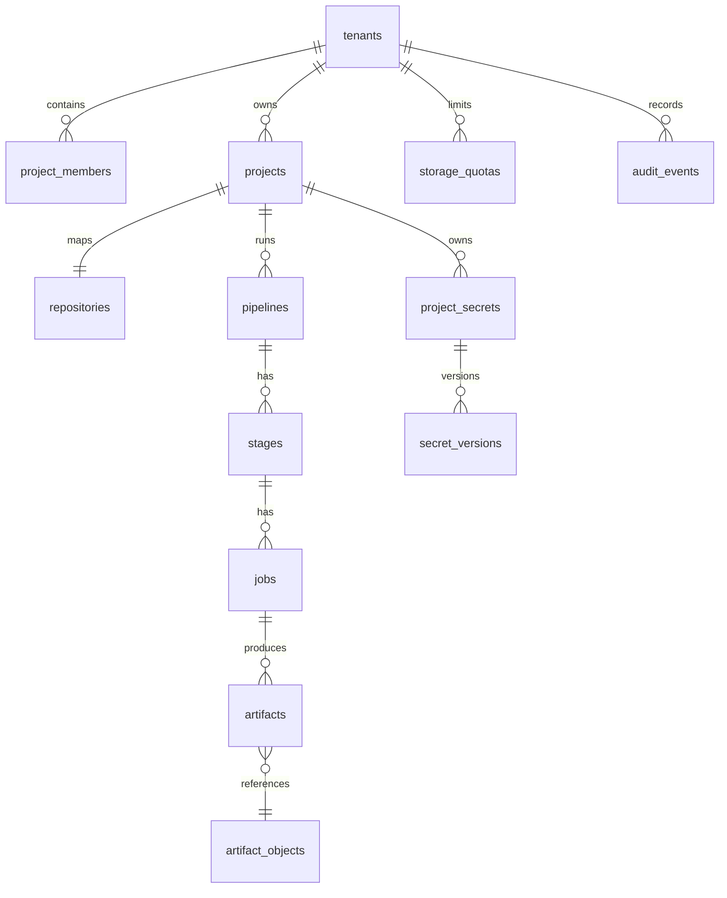

# Целевая архитектура хранения и жизненного цикла данных Forge CI/CD

## 1. Назначение и границы

Документ описывает целевую архитектуру персистентных данных Forge CI/CD: PostgreSQL, bare Git-репозитории, артефакты, секреты, резервное копирование, удаление и восстановление после аварии.

Цели:

- сделать изменение схемы повторяемым, проверяемым и обратимо управляемым;
- исключить неавторизованный доступ к Git, артефактам и секретам;
- отделить доменные правила от PostgreSQL, файловой системы, S3-совместимого storage и KMS;
- ввести контролируемые квоты, retention и удаление без «висячих» файлов;
- обеспечить проверяемые backup/restore и определённые RPO/RTO;
- сохранить публичные REST-контракты в ходе strangler-миграции.

Не входит в объём первой реализации: Git LFS, SSH transport, юридически значимые WORM-архивы, межрегиональный active-active и самостоятельный distributed runner protocol. Архитектурные точки расширения должны быть заложены сразу.

---

## 2. Текущее состояние и целевой результат

| Область | Сейчас | Целевое состояние |
|---|---|---|
| Схема PostgreSQL | `store::migrate()` выполняет единый `CREATE TABLE IF NOT EXISTS` при старте | Неизменяемые versioned SQLx migrations, отдельный migration runner, запрет DDL для runtime-роли |
| Тестовая БД | API contract-тесты в основном используют `app(None)` | Изолированная PostgreSQL для integration-тестов, миграции применяются до теста, параллельные тесты не делят данные |
| Репозитории | Строка `repositories` и bare-directory в volume; удаление сначала удаляет строку, затем best-effort директорию | Реестр с состояниями provision/delete, стабильным `storage_key`, saga/reconciler, проверка `git fsck`, backup-aware purge |
| Связь project/repository | Поиск проекта по URL suffix `LIKE '%name.git'` | Явный `repositories.project_id`, уникальная связь и Git push event с repository ID/commit SHA |
| Артефакты | Локальная ФС, лимит одного upload 50 MiB, DB-row после записи файла, checksum отсутствует | Порт object storage; потоковая загрузка, SHA-256, временный объект, квоты/резервы, retention worker, авторизованная загрузка |
| Секреты | AES-256-GCM под единым `CICD_SECRETS_KEY`; формат `v1:nonce:ciphertext` | Envelope encryption: per-secret DEK, KMS/KEK key ID, AAD, версии, rewrap и безопасная ротация |
| Пагинация | Часть списков без limit, часть с `LIMIT 50`, offset/cursor-контракт отсутствует | Единый bounded keyset pagination и составные индексы под каждый список |
| Backup | Ручной `pg_dump`; Git/artifact volumes в backup-процессе не учтены | Координированный backup manifest для PG, Git, objects и ключевых версий; регулярный restore drill |
| Retention/удаление | CASCADE удаляет DB-строки; файлы артефактов и Git могут остаться | Политики хранения, soft-delete/tombstone, outbox/reconciler, криптографическое и физическое удаление |
| DR | RPO/RTO и процедура восстановления не определены | Документированные RPO/RTO, off-site копия, immutable backup, проверка восстановления по расписанию |

### Выявленные ограничения текущей реализации

- `CREATE TABLE IF NOT EXISTS` не выражает изменения существующих колонок, индексов, ограничений и данных; успешный старт не означает соответствие ожидаемой схеме.
- `next_log_sequence()` вычисляет `MAX(sequence) + 1`; конкурентная запись логов одного job может получить один sequence.
- Артефакт сначала пишется в локальный файл, затем создаётся DB-строка. Ошибка INSERT оставляет orphan file; ошибка удаления строки не удаляет файл.
- Для artifact download нет RBAC-проверки; наличие UUID является фактическим доступом.
- `storage_path` хранит путь ФС, а не логический ключ object storage.
- Удаление bare-репозитория не имеет состояния, повторяемости, quarantine-периода и надёжной компенсации.
- Один глобальный AES-ключ не содержит ID версии ключа в модели данных и не даёт безопасно выполнить ротацию без одномоментного массового перешифрования.
- В текущих документах Git указан как `git2`, но реализация Smart HTTP и provisioning использует системную команду `git`; в target это должно быть явно оформлено отдельным адаптером.

---

## 3. Архитектурные принципы

1. **PostgreSQL хранит метаданные и намерения, object storage и Git-хранилище — байты.** Ни один внешний объект не считается опубликованным, пока нет committed metadata.
2. **Объекты неизменяемы.** Перезапись артефакта создаёт новую artifact version; секрет обновляется новой secret version; Git refs меняются только Git-протоколом.
3. **Нет распределённой транзакции между PostgreSQL, Git и S3.** Вместо неё применяются состояния, outbox, идемпотентные операции и reconciler.
4. **Авторизация выполняется до выдачи данных.** Object storage не публичен; прямой доступ к bucket/volume запрещён.
5. **Удаление — процесс, а не одиночный SQL `DELETE`.** Сначала блокируется доступ, затем удаляются данные, затем фиксируется результат.
6. **Все списки ограничены и стабильно упорядочены.** Пагинация не зависит от offset при изменяющихся данных.
7. **Production runtime не владеет DDL.** Миграции исполняются отдельной ролью и отдельным шагом доставки.
8. **Секреты write-only.** API, журнал аудита, ошибки и трассировки никогда не содержат plaintext и ciphertext.
9. **Backup ценен только после успешного restore verification.**

---

## 4. Целевая структура workspace и ports/adapters

```text
backend/
├── domain/                         # сущности, value objects, политики
├── app/                            # use cases, транзакционные сценарии
├── infra/
│   ├── postgres/                   # SQLx repositories, outbox, migrator support
│   ├── git/                        # bare Git adapter, hook/event adapter
│   ├── artifacts/                  # local FS и S3-compatible adapters
│   ├── secrets/                    # envelope encryption, KMS/KEK adapters
│   └── backup/                     # manifest, restore verification adapters
├── api/                            # HTTP DTO, auth middleware, cursor DTO
├── server/                         # composition root, workers, scheduler
├── migration/
│   ├── migrations/                 # immutable SQLx .sql migrations
│   └── src/bin/forge-migrate.rs    # migrate/check/adopt-legacy
├── tests/                          # real-DB black-box и adapter integration tests
└── scripts/                        # test DB, backup/restore/verify helpers
```

### 4.1 Доменные порты

`domain` и `app` определяют интерфейсы, не импортируя SQLx, Axum, файловую систему, S3 SDK, Docker или KMS SDK.

```rust
trait ProjectRepository;
trait PipelineRepository;
trait ArtifactRepository;
trait RepositoryRegistry;
trait SecretRepository;
trait AuditLogRepository;
trait OutboxRepository;

trait GitRepositoryStore {
    async fn provision(&self, repo: &RepositoryRecord) -> Result<ProvisionedRepo, GitStoreError>;
    async fn verify(&self, storage_key: &RepoStorageKey) -> Result<GitIntegrity, GitStoreError>;
    async fn quarantine(&self, storage_key: &RepoStorageKey) -> Result<(), GitStoreError>;
    async fn purge(&self, storage_key: &RepoStorageKey) -> Result<(), GitStoreError>;
}

trait ArtifactObjectStore {
    async fn put_staged(&self, input: PutObject) -> Result<StagedObject, ObjectStoreError>;
    async fn promote(&self, staged: &StagedObject, key: &ObjectKey) -> Result<ObjectVersion, ObjectStoreError>;
    async fn open_authorized(&self, key: &ObjectKey, range: Option<ByteRange>)
        -> Result<ObjectStream, ObjectStoreError>;
    async fn delete(&self, key: &ObjectKey, version: Option<&ObjectVersion>)
        -> Result<(), ObjectStoreError>;
}

trait EnvelopeKeyProvider {
    async fn generate_data_key(&self, context: EncryptionContext) -> Result<DataKeyEnvelope, KeyError>;
    async fn unwrap_data_key(&self, envelope: &EncryptedDataKey, context: EncryptionContext)
        -> Result<PlainDataKey, KeyError>;
    async fn rewrap_data_key(&self, envelope: &EncryptedDataKey, from: KeyRef, to: KeyRef)
        -> Result<EncryptedDataKey, KeyError>;
}
```

### 4.2 Адаптеры

| Порт | Первый production-адаптер | Альтернатива / развитие |
|---|---|---|
| PostgreSQL repositories | SQLx + PostgreSQL 17 | Тестовый adapter не нужен: integration-тесты используют настоящую PG |
| `GitRepositoryStore` | `BareGitStore` на выделенном persistent volume, системный `git` | NFS/CephFS adapter только после нагрузочного и locking-audit |
| `ArtifactObjectStore` | `S3ObjectStore` для S3/MinIO | `LocalArtifactStore` допустим только dev/single-node |
| `EnvelopeKeyProvider` | KMS/Vault transit | Development adapter на локальный master key без production-доступа |
| Backup sink | S3-compatible versioned bucket | Второй независимый off-site provider |
| Scheduler/reconciler | PostgreSQL lease + `FOR UPDATE SKIP LOCKED` | Отдельный worker service при росте нагрузки |

`server` — единственная точка сборки адаптеров. HTTP handler вызывает application use case; handler не строит SQL и не работает с путями файлов.

---

## 5. PostgreSQL: ownership, схема и миграции

## 5.1 Роли и владение

Для каждого production-окружения создаются отдельные учётные записи:

| Роль | Права |
|---|---|
| `forge_owner` | Владелец database/schema/таблиц/sequence; применяется только migration и restore jobs |
| `forge_app` | `CONNECT`, `USAGE` schema, `SELECT/INSERT/UPDATE/DELETE` на разрешённых таблицах и sequence; без `CREATE`, `ALTER`, `DROP`, `TRUNCATE` |
| `forge_backup` | Минимальные права для backup либо управляемая backup-role провайдера |
| `forge_readonly` | Опционально для безопасной диагностики и отчётов; без секретных ciphertext-колонок |
| `forge_test` | Только test PostgreSQL instance/database; право создавать тестовые DB |

Все прикладные таблицы располагаются в schema `forge`; `public` не используется для доменных таблиц.

```sql
CREATE SCHEMA forge AUTHORIZATION forge_owner;
ALTER ROLE forge_app IN DATABASE forge SET search_path = forge, public;

GRANT USAGE ON SCHEMA forge TO forge_app;
GRANT SELECT, INSERT, UPDATE, DELETE ON ALL TABLES IN SCHEMA forge TO forge_app;
GRANT USAGE, SELECT ON ALL SEQUENCES IN SCHEMA forge TO forge_app;

ALTER DEFAULT PRIVILEGES FOR ROLE forge_owner IN SCHEMA forge
  GRANT SELECT, INSERT, UPDATE, DELETE ON TABLES TO forge_app;
ALTER DEFAULT PRIVILEGES FOR ROLE forge_owner IN SCHEMA forge
  GRANT USAGE, SELECT ON SEQUENCES TO forge_app;
```

Расширение `pgcrypto` создаётся migration-role заранее и используется только для DB-generated UUID при необходимости. Runtime не получает `CREATE EXTENSION`.

## 5.2 SQLx migrations

Миграции находятся в `backend/migrations/`:

```text
20260826090000_bootstrap_schema.sql
20260826091000_projects_and_repository_mapping.sql
20260826092000_pipeline_indexes_and_keyset.sql
20260826093000_artifact_objects_and_quotas.sql
20260826094000_secret_envelopes.sql
20260826095000_outbox_and_deletion_jobs.sql
20260826100000_audit_retention_and_backup_catalog.sql
```

Правила:

- имя: UTC timestamp + краткое snake_case описание;
- migration после merge **не редактируется и не переименовывается**;
- любая корректировка создаётся следующей migration;
- SQLx сохраняет checksum и историю в `_sqlx_migrations` в schema `forge`;
- migration job запускается до запуска новых app pods;
- runtime запускает `sqlx::migrate!()` только в режиме verify: проверяет, что pending migration отсутствуют, и завершает startup с ошибкой при несоответствии;
- `store::migrate()` удаляется после полного перехода и не остаётся fallback-механизмом.

### Bootstrap и существующие инсталляции

Для пустой базы baseline migration создаёт целевую начальную структуру.

Для существующей базы, созданной старым `store::migrate()`:

1. сделать verified backup до миграции;
2. остановить writers или включить maintenance mode;
3. выполнить `forge-migrate inspect-legacy`;
4. проверить набор таблиц, колонок, типов, PK/FK/check/indexes относительно поддерживаемого legacy fingerprint;
5. выполнить `forge-migrate adopt-legacy` только после успешной проверки;
6. зарегистрировать baseline как применённую migration;
7. применить последующие additive/backfill migrations;
8. запустить schema verification и smoke-тест.

`adopt-legacy` не должен «угадывать» произвольную схему и не должен ставить отметку в `_sqlx_migrations`, если fingerprint не совпал. Несовпадение — блокер с ручным migration plan.

### Типы migration

- **Expand:** добавить nullable колонку, новую таблицу, новый индекс `CONCURRENTLY` отдельной non-transactional migration.
- **Backfill:** идемпотентно заполнять малыми batch; фиксировать progress в `migration_progress`.
- **Contract:** добавить `NOT NULL`, FK, CHECK и удалить legacy путь только после dual-read/dual-write периода.
- **Drop:** только после подтверждённого срока совместимости, backup и отсутствия зависимостей.

Для больших индексов применяется migration с `-- no-transaction --` по соглашению SQLx и `CREATE INDEX CONCURRENTLY`; rollback описывается в accompanying runbook.

---

## 6. Целевая модель данных

## 6.1 Границы владения

В перспективе все project-scoped сущности принадлежат `tenant`:



`tenant` в первой фазе может иметь единственную системную строку для переноса текущих данных. Это сохраняет путь к multi-project/multi-team ownership без немедленной перестройки UI.

## 6.2 Основные таблицы

| Таблица | Назначение и существенные поля |
|---|---|
| `tenants` | `id`, `slug`, `name`, `status`, `created_at`, `deleted_at` |
| `users`, `project_members` | Пользователь, роль в проекте/тенанти, `enabled`, timestamps; доступ не определяется URL или UUID |
| `projects` | `id`, `tenant_id`, `name`, `repository_url`, `default_branch`, `artifact_retention_days`, `deleted_at` |
| `repositories` | `id`, `project_id UNIQUE`, `slug`, `storage_key UNIQUE`, `state`, `hook_version`, `provisioned_at`, `delete_after`, `last_verified_at`, `deleted_at` |
| `pipelines` | `id`, `project_id`, `repository_id`, `git_ref`, `commit_sha`, `source`, `idempotency_key`, status/timestamps |
| `stages`, `jobs` | Существующая модель исполнения; `jobs` получает `next_log_sequence`, `retention_until`, optional `deleted_at` |
| `job_logs` | Append-only log events: `id`, `job_id`, `sequence`, `stream`, `message`, `created_at`; retention согласован с job/pipeline |
| `artifact_objects` | Физический immutable object: `id`, `storage_backend`, `object_key`, `object_version`, `sha256 BYTEA`, `size_bytes`, `state`, `created_at`, `deleted_at` |
| `artifacts` | Логический artefact: `id`, `job_id`, `object_id`, display `name`, content type, `expires_at`, `hold_reason`, `state`, `deleted_at` |
| `storage_quotas`, `storage_usage`, `quota_reservations` | Лимиты org/project, фактическое использование, активные резервы upload |
| `project_secrets` | Метаданные секрета: `id`, `project_id`, `key`, `active_version`, `deleted_at`; plaintext отсутствует |
| `secret_versions` | Ciphertext, encrypted DEK, `kek_key_id`, algorithm, AAD version, `created_by`, `superseded_at`, `destroyed_at` |
| `outbox_messages` | Транзакционно записанные события: artifact promotion/purge, repository provision/purge, audit, webhook |
| `deletion_jobs` | `resource_type`, `resource_id`, `state`, attempts, `not_before`, error code; повторяемое физическое удаление |
| `backup_catalog` | Backup manifest, scope, PG LSN, object/Git snapshot IDs, checksum, encryption key ID, restore verification result |
| `audit_events` | Append-only: actor, tenant/project scope, action, resource, request/correlation ID, redacted metadata, timestamp |

Не хранить в PostgreSQL:

- содержимое Git-объектов;
- тела артефактов;
- plaintext секретов;
- токены или ключи шифрования;
- абсолютные filesystem paths;
- секретные URL с credentials.

## 6.3 Связи и delete policy

- `projects → pipelines → stages → jobs` сохраняет CASCADE только для transient execution metadata, если проект не находится в managed deletion workflow.
- `projects → repositories` — `RESTRICT`: project нельзя удалить «мгновенно», пока repository не помещён в deletion workflow.
- `artifacts → artifact_objects` — `RESTRICT`; physical object удаляется только если нет активных artifact references.
- `project_secrets → secret_versions` — не CASCADE в пользовательском запросе: сначала revoke access, затем scheduled cryptographic erasure.
- `api_tokens.user_id` — `SET NULL` только если audit actor уже денормализован в audit event.
- Исторические audit events не удаляются CASCADE вместе с бизнес-сущностью; resource может стать tombstone.

---

## 7. Индексы, конкуренция и пагинация

## 7.1 Обязательные индексы

Ниже перечислены целевые индексы; итоговый набор уточняется `EXPLAIN (ANALYZE, BUFFERS)` на production-like данных.

```sql
CREATE UNIQUE INDEX projects_org_name_uq
  ON forge.projects (tenant_id, name)
  WHERE deleted_at IS NULL;

CREATE INDEX pipelines_project_created_idx
  ON forge.pipelines (project_id, created_at DESC, id DESC)
  WHERE deleted_at IS NULL;

CREATE INDEX pipelines_project_status_created_idx
  ON forge.pipelines (project_id, status, created_at DESC, id DESC)
  WHERE deleted_at IS NULL;

CREATE INDEX stages_pipeline_position_idx
  ON forge.stages (pipeline_id, position);

CREATE INDEX jobs_stage_position_idx
  ON forge.jobs (stage_id, position);

CREATE INDEX jobs_claim_idx
  ON forge.jobs (status, created_at, id)
  WHERE status = 'queued';

CREATE INDEX job_logs_job_sequence_idx
  ON forge.job_logs (job_id, sequence);

CREATE INDEX artifacts_job_created_idx
  ON forge.artifacts (job_id, created_at DESC, id DESC)
  WHERE state = 'available';

CREATE INDEX artifacts_expiry_idx
  ON forge.artifacts (expires_at, id)
  WHERE state IN ('available', 'expired', 'delete_pending')
    AND hold_reason IS NULL;

CREATE UNIQUE INDEX artifact_objects_storage_key_uq
  ON forge.artifact_objects (storage_backend, object_key, object_version);

CREATE INDEX deletion_jobs_due_idx
  ON forge.deletion_jobs (state, not_before, id)
  WHERE state IN ('queued', 'retry');

CREATE INDEX outbox_dispatch_idx
  ON forge.outbox_messages (state, available_at, id)
  WHERE state IN ('pending', 'retry');

CREATE INDEX audit_events_scope_created_idx
  ON forge.audit_events (tenant_id, created_at DESC, id DESC);
```

Индексы FK добавляются для всех frequently joined child keys: `pipeline.project_id`, `stage.pipeline_id`, `job.stage_id`, `artifact.job_id`, `secret.project_id`, `repository.project_id`, `project_member.project_id`.

## 7.2 Атомарность и блокировки

- Claim queued job: один `UPDATE ... WHERE status = 'queued' ... RETURNING` либо `SELECT ... FOR UPDATE SKIP LOCKED` внутри короткой транзакции.
- Следующий log sequence: `UPDATE jobs SET next_log_sequence = next_log_sequence + 1 WHERE id = $1 RETURNING next_log_sequence`; не `MAX()+1`.
- Quota reservation: блокировка строки `storage_usage` или атомарный conditional update, чтобы конкурентные uploads не превысили лимит.
- Retention/reconciler workers выбирают work через `FOR UPDATE SKIP LOCKED`, имеют lease и идемпотентный результат.
- Любое изменение state проверяет ожидаемое предыдущее состояние (`WHERE state = $expected`) и возвращает conflict при потере гонки.

## 7.3 Единый cursor contract

Все collection endpoint используют:

```text
GET /api/v1/projects/{project_id}/pipelines?limit=50&cursor=<opaque>&status=failed
```

Правила:

- `limit`: default 50, min 1, max 100;
- основная сортировка: `created_at DESC, id DESC`;
- cursor содержит `created_at`, `id`, направление и hash применённых filters;
- cursor opaque: base64url JSON либо подписанный/зашифрованный envelope;
- cursor нельзя использовать с другим набором filters;
- ответ: `{ "items": [...], "next_cursor": "...|null" }`;
- `OFFSET` не используется в UI/API списках, где данные могут добавляться или удаляться;
- job logs используют cursor `after_sequence` и стабильную сортировку `sequence ASC`;
- отчётные aggregate-запросы могут иметь отдельный API с ограниченным временным диапазоном.

---

## 8. Жизненный цикл bare Git-репозитория

## 8.1 Идентичность и путь

Внешнее имя репозитория — `slug`, но файловая идентичность не зависит от имени:

```text
<git-root>/org/<tenant-id>/repo/<repository-id>.git
```

`repositories.storage_key` содержит логический идентификатор, а не абсолютный path. Переименование slug не двигает repository directory и не ломает clone URLs.

## 8.2 Создание

1. Application service проверяет роль `maintainer` или выше в проекте.
2. В PostgreSQL создаётся `repositories` row: `state = provisioning`, `storage_key`, `project_id`.
3. В той же транзакции записывается outbox event `repository.provision.requested`.
4. Git worker создаёт directory с безопасными правами, выполняет `git init --bare`, задаёт policy/config и устанавливает versioned hook.
5. Worker проверяет bare repository через `git rev-parse --is-bare-repository` и `git fsck --no-dangling`.
6. В транзакции состояние меняется на `active`, фиксируются `provisioned_at`, `hook_version`, audit event.
7. При сбое объект остаётся `provisioning`/`error`; reconciler может повторить или оператор явно удаляет failed provisioning.

Нельзя считать DB row и directory атомарными. State machine и идемпотентный provisioning обязательны.

## 8.3 Push и trigger

Целевой post-receive hook не хранит статический API token в git directory и не делает URL suffix lookup.

Hook передаёт repository ID, old SHA, new SHA и ref name в локальный trusted hook service через Unix socket. Если HTTP неизбежен, event подписывается per-repository HMAC key и содержит timestamp/nonce; сервер отклоняет повтор, истёкшее время и неподписанный event.

Application service:

- получает repository по ID;
- проверяет `state = active`;
- игнорирует delete refs, если pipeline для delete не поддерживается;
- фиксирует конкретный `commit_sha`, а не только mutable branch name;
- создаёт pipeline с idempotency key `(repository_id, new_sha, ref_name, trigger_kind)`;
- связывает pipeline с `repository_id` и `project_id` напрямую.

## 8.4 Проверка и backup

- Периодический verifier выполняет `git fsck --no-dangling` с ограничениями времени и фиксирует `last_verified_at`.
- Перед backup выполняется integrity check или используется последний успешный результат, не старше заданного SLO.
- Снимок Git выполняется filesystem snapshot на поддерживаемом storage либо `git bundle --all` для каждого active repository.
- Backup manifest хранит repository ID, ref snapshot/bundle checksum и snapshot version.

## 8.5 Удаление

1. Пользователь с ролью `admin` подтверждает delete; создаётся audit event.
2. Repository получает `state = delete_pending`, clone/push запрещаются.
3. Directory переносится в quarantine namespace либо остаётся read-disabled до `delete_after`.
4. После периода восстановления retention worker выполняет final `git fsck`, удаляет directory, подтверждает отсутствие path и ставит `state = deleted`.
5. Ошибка удаления переводит задачу в `retry`, но не возвращает сетевой доступ.
6. При отмене до purge repository можно вернуть из quarantine, проверив integrity.

Удаление project инициирует orchestration: сначала revoke доступа, затем repository/artifact/secret lifecycle. Нельзя выполнять `DELETE FROM projects` как единственную операцию удаления.

---

## 9. Артефакты: object storage, integrity, quota и download

## 9.1 Storage backend

Production backend — приватный versioned S3-compatible bucket. Bucket policy запрещает public ACL, list/get/put из frontend и неаутентифицированного API.

Локальный adapter допустим только для dev и single-node smoke:

```text
CICD_ARTIFACT_STORAGE=local|s3
CICD_ARTIFACTS_DIR=/var/lib/forge/artifacts        # только local
CICD_S3_BUCKET=forge-artifacts
CICD_S3_ENDPOINT=...
```

Ключ immutable object:

```text
org/<tenant-id>/project/<project-id>/sha256/<first-2>/<digest>
```

При включённой дедупликации object делится только в рамках тенанти и только при одинаковом digest/size. Межтенантонная дедупликация отключена: она усложняет изоляцию, квоты и доказательство удаления.

## 9.2 Upload protocol

1. API authorizes `artifact:write` для job/project и проверяет, что job допускает публикацию.
2. Body stream ограничен application-level и proxy-level limit; client filename не используется как path.
3. Stream пишется в temporary object, одновременно вычисляются SHA-256 и размер.
4. До promotion создаётся `quota_reservation`; при нехватке квоты возвращается `409 quota_exceeded`.
5. После завершения upload проверяются размер, digest и optional client-supplied `Digest: sha-256=...`.
6. Object store выполняет conditional promote/copy в immutable key; повторный запрос с тем же idempotency key возвращает существующий результат.
7. В короткой DB-транзакции создаются `artifact_objects` и `artifacts`, обновляется usage, пишется outbox/audit event.
8. Staged object удаляется. Если DB commit не состоялся, cleanup worker удаляет orphan staging object.
9. Artifact публикуется только в `state = available`.

Поля `artifact_objects`:

```text
id, storage_backend, object_key, object_version,
sha256, size_bytes, state,
created_at, verified_at, delete_requested_at, deleted_at
```

`artifacts` дополнительно хранит `name`, `content_type`, `job_id`, `object_id`, `expires_at`, `state`, hold metadata.

## 9.3 Checksums и download integrity

- SHA-256 вычисляется сервером при upload; client checksum — только дополнительная проверка.
- `sha256` хранится как 32-byte binary, отображается API в hex.
- Download response содержит `Digest: sha-256=<base64>`, `ETag` на основе digest/version и `Content-Length`.
- При restore или background verification object повторно хэшируется либо проверяется checksum provider-а.
- Несовпадение переводит artifact/object в `corrupt`, блокирует download и создаёт high-severity audit/alert.

## 9.4 Квоты

Есть три независимых ограничения:

| Ограничение | Пример | Реакция |
|---|---|---|
| Максимальный размер одного upload | 50 MiB сейчас; configurable per project | `413 Payload Too Large` |
| Project storage quota | 5 GiB | `409 quota_exceeded` до записи final object |
| Organization storage quota | 100 GiB | `409 quota_exceeded` до резервирования |

Usage состоит из `committed_bytes` и `reserved_bytes`. Reservation имеет TTL; abandoned upload освобождается worker-ом. Soft warning threshold — 80%, hard limit — 100%. Quota accounting и artifact row создаются в одной транзакции.

## 9.5 Авторизация download

`GET /api/v1/artifacts/{id}/download`:

1. Проверяет authentication и membership в project/org.
2. Проверяет роль/scope `artifact:read`.
3. Проверяет `state = available`, `expires_at`, legal hold и project deletion status.
4. Пишет audit event с actor, artifact ID, request ID, source IP policy-safe metadata.
5. Выдаёт один из вариантов:
   - backend proxy stream для local store и малых объектов;
   - короткоживущий signed URL (например, 60 секунд) для S3, подписанный только после app-level authorization.

Signed URL не кешируется как bearer credential, не отображается в audit body и не выдаётся для deleted/expired artifact. `Content-Disposition` формируется из безопасно нормализованного display name; заголовки не принимаются от клиента без allowlist.

---

## 10. Retention, удаление и data lifecycle

## 10.1 Политики хранения

| Данные | Начальная target policy | Механизм |
|---|---|---|
| Artifacts | Project default, например 30 дней; configurable min/max | `expires_at`, retention worker, legal hold |
| Job logs | 30–90 дней по project policy | batch/partition cleanup, скачивание до expiry при наличии доступа |
| Pipelines/jobs metadata | 180–365 дней, агрегаты дольше | controlled purge, не CASCADE user request |
| Audit events | минимум 365 дней | append-only, partition/archival |
| Deleted Git repository | quarantine 7–30 дней | state machine и final purge |
| Secret versions | active + superseded пока нужна rollback политика | crypto erasure после window |
| Backups | daily 35 дней, monthly 12 месяцев — пример | backup retention policy, immutable copy |

Конкретные сроки конфигурируются по окружению и требованиям тенанти; они не должны быть hard-coded в handler.

## 10.2 Retention worker

Worker запускается по расписанию и выбирает due rows через `FOR UPDATE SKIP LOCKED`.

Для artifact:

1. `available → expired`: доступ блокируется, usage может ещё учитываться до physical delete.
2. Если hold отсутствует, создаётся `deletion_job`.
3. Worker удаляет object version идемпотентно.
4. После успешного delete ставится `artifact_objects.deleted_at`, artifact `purged`.
5. Usage освобождается транзакционно только после подтверждённого удаления.
6. Если backend недоступен, задача retry с exponential backoff и alert после порога.

Retention никогда не удаляет shared `artifact_object`, пока существуют активные references.

## 10.3 Удаление project/tenant

Удаление — asynchronous operation с состояниями:

```text
active -> delete_requested -> access_revoked -> purging -> deleted
                                     \-> delete_failed
```

Последовательность:

- блокировать новый pipeline, upload, secret injection, clone/push и download;
- создать immutable deletion request/audit event;
- выставить сроки удаления ресурсов;
- поставить в очередь Git, artifacts, secret versions и dependent metadata;
- сохранить tombstone с минимальными идентификаторами, причиной и timestamp;
- после успешного purge удалить operational metadata по policy;
- audit record и backup catalog сохраняются по своему retention.

## 10.4 Право на удаление и legal hold

- Пользовательское удаление требует роли `admin` либо отдельного scope.
- Legal hold/incident hold запрещает физическое удаление artifact/repository metadata до снятия hold уполномоченным оператором.
- Hold не выдаёт доступ к данным автоматически.
- Все создание/снятие hold аудируются.

---

## 11. Секреты: envelope encryption и ротация ключей

## 11.1 Целевая envelope-модель

Для каждого secret version создаётся случайный 256-bit DEK:

1. plaintext шифруется AES-256-GCM под DEK;
2. DEK заворачивается KEK из KMS/Vault transit;
3. PostgreSQL хранит только ciphertext, nonce, encrypted DEK и ключевые метаданные;
4. plaintext DEK существует в памяти только на время encrypt/decrypt и очищается best-effort;
5. plaintext секрета передаётся только runner-у по защищённому execution channel и не попадает в логи.

`secret_versions` хранит:

```text
id, secret_id, version,
ciphertext BYTEA, nonce BYTEA,
encrypted_dek BYTEA, kek_key_id TEXT,
algorithm = aes-256-gcm,
aad_version SMALLINT,
created_at, created_by,
superseded_at, destroyed_at
```

Additional authenticated data:

```text
forge:secret:v1:<tenant_id>:<project_id>:<secret_id>:<version>
```

AAD связывает ciphertext с конкретным scope и не позволяет подменить ciphertext между проектами или ключами.

## 11.2 API и runner boundary

- API возвращает только metadata: key, version, created/updated timestamps, state.
- Secret value показывается только в create/update request и не возвращается response.
- Decrypt use case доступен только trusted runner-dispatch path после проверки project/job permissions.
- Decrypted values inject-ятся в process environment или protected temporary file; не передаются через command line.
- Runner redactor получает зарегистрированные plaintext values только на время job и маскирует их в stdout/stderr.
- Secret нельзя включать в audit payload, tracing span, panic report, metrics label или error message.

## 11.3 Ротация

### Ротация KEK

KEK rotation не требует немедленно расшифровывать каждый secret:

1. KMS создаёт новую KEK version.
2. New writes используют новую `kek_key_id`.
3. Rewrap worker получает старый encrypted DEK и вызывает KMS rewrap в новый KEK; plaintext secret не покидает KMS boundary, если provider поддерживает re-encrypt.
4. DB transaction заменяет `encrypted_dek` и `kek_key_id`, оставляя ciphertext неизменным.
5. Старый KEK не отключается, пока:
   - все active secret versions не rewrapped;
   - не завершён backup retention, содержащий encrypted DEK под старым KEK;
   - не подтверждён restore drill с новым набором ключей.

### Ротация secret value

- Создаётся новая `secret_version`.
- Предыдущая версия получает `superseded_at`.
- Runner по умолчанию использует только active version.
- Rollback возможен только в установленном version retention window и требует audit.
- После expiry выполняется crypto erasure: удаляются ciphertext и encrypted DEK; KMS key material не удаляется, пока не выполнены условия backup retention.

## 11.4 Миграция legacy AES-GCM

Текущий формат `v1:nonce:ciphertext` под `CICD_SECRETS_KEY` мигрируется отдельно:

1. временно поддерживаются legacy decrypt и target envelope decrypt;
2. batch worker читает одну строку, расшифровывает legacy ключом в памяти, немедленно создаёт envelope version;
3. новая строка committed до удаления legacy ciphertext;
4. plaintext, nonce и legacy ciphertext не логируются;
5. после отчёта о 100% миграции legacy column удаляется отдельной contract migration;
6. legacy `CICD_SECRETS_KEY` сохраняется в защищённом vault до завершения backup retention либо до доказанного уничтожения всех legacy backups.

---

## 12. Backup, restore verification и DR

## 12.1 Цели

Начальные SLO для production:

| Параметр | Цель |
|---|---|
| RPO для PostgreSQL metadata | до 15 минут |
| RPO для artifacts/Git | до 24 часов, затем улучшить до 15 минут для versioned object replication |
| RTO single-region restore | до 4 часов |
| Restore verification | минимум ежемесячно; после существенного изменения migration/storage/key policy — внеочередной drill |
| Backup encryption | обязательно at rest и in transit |
| Off-site copy | обязательно, независимый failure domain |

Эти значения являются начальной эксплуатационной политикой и должны быть пересмотрены владельцем сервиса до production launch.

## 12.2 Состав backup

Backup считается complete только при наличии manifest, включающего:

- PostgreSQL backup ID, timestamp, WAL/LSN boundary, migration version/checksum;
- Git snapshot или bundle ID и SHA-256 для каждого active repository;
- object storage inventory/version IDs, checksum manifest и bucket versioning state;
- list required KMS key IDs, но не plaintext keys;
- backup encryption key ID;
- schema/application version;
- итоговый digest всего manifest.

PostgreSQL:

- continuous WAL archiving + physical base backup для PITR;
- ежедневный logical `pg_dump --format=custom` для переносимого restore;
- `pg_verifybackup` либо equivalent provider verification.

Git:

- snapshot persistent volume на storage с crash-consistency гарантией **либо** `git bundle --all` после `git fsck`;
- backup не считается успешным без проверки bundle/snapshot checksum.

Артефакты:

- versioned bucket, server-side encryption, cross-zone/off-site replication;
- backup manifest фиксирует конкретные object versions, а не только keys;
- object lifecycle не может удалить backup version раньше backup retention.

## 12.3 Координация backup

Невозможна одна ACID-транзакция для PG, Git и object storage, поэтому процедура использует checkpoint:

1. Создать `backup_run` с correlation ID.
2. Получить PostgreSQL LSN/checkpoint и переключить backup manifest в `building`.
3. Снять Git snapshot/bundles и object inventory/version list.
4. Выполнить PostgreSQL backup/WAL archive.
5. Сохранить manifest, checksums, key references и LSN.
6. Записать `backup_catalog.status = verified` только после integrity checks.
7. Реплицировать manifest и backup data в off-site location.

Во время backup не требуется останавливать control plane, но snapshot mechanism должен поддерживать согласованность. При отсутствии versioned storage допускается краткий maintenance/write freeze; это фиксируется в runbook.

## 12.4 Restore procedure

Восстановление выполняется сначала в изолированном environment, никогда не поверх работающего production:

1. Развернуть пустую PostgreSQL instance и создать `forge_owner`, `forge_app`, schema permissions.
2. Restore PostgreSQL до указанного LSN/backup timestamp.
3. Запустить migration verify в режиме без DDL; убедиться, что версия schema соответствует manifest.
4. Restore Git snapshots/bundles в новый `CICD_GIT_ROOT`; выполнить `git fsck` для выборки и всех критичных repositories.
5. Restore artifact object versions; сверить count/bytes/digests с manifest.
6. Проверить доступность требуемых KMS key versions и расшифровать test secret в controlled test project.
7. Выполнить smoke: read-only API, list projects, pipeline detail, authorized artifact download, clone test repository.
8. Сформировать restore report: duration, данные, отсутствующие объекты, checksum mismatches, migration version.
9. Только после явного решения incident commander переключать DNS/traffic на restored environment.

## 12.5 DR сценарии

| Сценарий | Первичная реакция | Восстановление |
|---|---|---|
| Потеря API pod | Пересоздать stateless service | PG/Git/object data не затрагиваются |
| Потеря PostgreSQL volume | Stop writers, поднять новую PG | PITR до последнего допустимого LSN, затем reconcile outbox |
| Потеря artifact bucket/volume | Блокировать uploads/downloads, не удалять metadata | Restore object versions и сверка checksum |
| Повреждён bare repo | Изолировать repo, запретить push/clone | Restore last healthy Git snapshot/bundle, `git fsck` |
| Компрометация KEK | Disable affected key, остановить decrypt | Rotate KEK, rewrap/re-encrypt, расследование audit trail |
| Ошибочная массовая deletion policy | Stop retention worker, поставить hold | Restore metadata/objects/Git из pre-incident backup, выборочно снять tombstones |

После любого partial restore запускается reconciler: он сверяет metadata с реальным Git/object storage и создаёт incident records, но не удаляет данные автоматически в первые 24 часа recovery window.

---

## 13. Набор тестов и критерии приёмки

## 13.1 Migration и PostgreSQL

- Пустая PostgreSQL: применить все migrations, проверить schema/roles/indexes/FK.
- Legacy fixture: `inspect-legacy` принимает только поддерживаемый bootstrap fingerprint.
- Legacy mismatch: `adopt-legacy` отказывается без изменения `_sqlx_migrations`.
- Upgrade test: baseline → все последующие migrations.
- Каждая migration тестируется на empty DB и на предыдущей released schema.
- Проверка, что `forge_app` не может выполнить DDL.
- Concurrency: два runner-а не получают один job; параллельные log writes не дублируют sequence.
- Query-plan test/benchmark для ключевых list queries на representative dataset.

## 13.2 Test DB

`docker-compose.test.yml` поднимает отдельный PostgreSQL без production volume и портов по умолчанию.

Подход:

1. CI запускает isolated PG service.
2. `forge-migrate up` применяет migrations в template database.
3. Каждый integration test создаёт database `forge_test_<uuid>` из template либо отдельную schema/database.
4. Test fixture выдаёт только URL с database name, начинающимся `forge_test_`.
5. Защитный код отказывается запускать destructive test setup, если URL не содержит test marker.
6. После теста database удаляется; cleanup job ищет stale `forge_test_*`.

Обязательные real-DB сценарии:

- CRUD проекта и membership authorization;
- pipeline/job state machine и aggregate statuses;
- keyset pagination при одновременном добавлении pipelines;
- upload с правильным/неправильным digest, повтор idempotency key, quota race;
- download auth: viewer с доступом получает объект, пользователь другого project — `404` или policy-safe `403`;
- retention purge и retry после временной ошибки storage;
- Git provision, duplicate request, quarantine/delete/reconcile;
- legacy secret migration, decrypt, KEK rewrap и key-unavailable failure;
- outbox retry, exactly-once observable effect через идемпотентные consumer keys;
- backup manifest verification и isolated restore smoke.

## 13.3 Adapter tests

- `BareGitStore`: invalid path/slug, failed hook install, idempotent provision, `git fsck`, quarantine/purge.
- `S3ObjectStore`: conditional put, multipart/stream abort, versioned delete, signed URL TTL, checksum mismatch.
- `LocalArtifactStore`: path traversal rejected, symlink escape prevented, atomic promotion.
- KMS/Vault adapter: AAD mismatch, wrong key ID, rewrap, revoked key.
- Backup adapter: missing object/version/checksum и неполный manifest считаются failure.

---

## 14. План rollout

## Фаза 0 — Подготовка

- Зафиксировать ADR для SQLx migrations, artifact storage/retention, secret envelope encryption и backup ownership.
- Собрать inventory текущих DB schemas, Git volumes и artifact files.
- Сделать первый verified backup текущих PostgreSQL, `cicd_git_repos` и `cicd_artifacts`.
- Добавить observability: request ID, storage operation ID, worker metrics, structured error codes.
- Не менять публичные API paths.

**Gate:** backup можно восстановить в isolated environment; инвентаризация не содержит plaintext secrets.

## Фаза 1 — Миграции и test harness

- Добавить `migration` package, SQLx baseline и `forge-migrate`.
- Ввести `forge_owner`/`forge_app`, schema `forge`, migration job.
- Реализовать legacy inspect/adopt path.
- Создать `docker-compose.test.yml`, DB fixture и real-DB CI job.
- Удалить startup DDL только после успешного adoption всех поддерживаемых installations.

**Rollback:** до contract phase приложение временно совместимо с legacy tables; при migration failure deployment останавливается, DB восстанавливается из pre-migration backup, а не «откатывается вручную» неподтверждённым SQL.

## Фаза 2 — PostgreSQL repositories и pagination

- Вынести SQL из `api.rs`/`platform.rs` в `infra/postgres`.
- Добавить project/repository mapping, индексы и cursor contract.
- Заменить `MAX(sequence)+1` атомарным счётчиком.
- Перевести API routes по вертикалям через app ports.

**Gate:** existing REST payloads совместимы; real-DB tests покрывают каждую перенесённую вертикаль.

## Фаза 3 — Git lifecycle

- Ввести `RepositoryRegistry`, `BareGitStore`, provisioning/deletion state machine и outbox.
- Перевести hook на repository ID event.
- Включить Git verifier и quarantine delete.
- Добавить Git в backup manifest.

**Gate:** repeated create/delete безопасны; crash между DB и filesystem converges через reconciler; clone/push после delete request запрещены.

## Фаза 4 — Артефакты

- Ввести object storage port и local/S3 adapters.
- Добавить `artifact_objects`, checksum, quota reservations, signed download flow.
- Запустить retention/reconcile workers в observe-only mode.
- Сверить текущие local files с DB и импортировать их с вычисленным checksum.
- После отчёта включить enforcement квот и retention.

**Gate:** orphan rate равен нулю после reconciliation; unauthorized download невозможен; restore artifact из backup проходит checksum verification.

## Фаза 5 — Секреты

- Включить KMS/Vault integration и target secret schema.
- Выполнить controlled legacy envelope migration.
- Включить decrypt только через runner boundary.
- Провести KEK rewrap drill в staging.

**Gate:** API не возвращает value/ciphertext; successful rotation и restore доказаны тестом; retired key не отключается преждевременно.

## Фаза 6 — Backup, retention и DR

- Настроить PITR/WAL, Git snapshots/bundles, versioned object replication и encrypted off-site copies.
- Реализовать `backup_catalog`, manifest verification и alerts.
- Включить deletion/retention workers.
- Провести первый full restore drill и зафиксировать фактические RPO/RTO.

**Gate:** restore report проходит все checks, фактический RTO укладывается в согласованный SLO, операционный runbook утверждён.

---

## 15. Метрики, аудит и эксплуатационные сигналы

Минимальные метрики:

- `forge_migration_version`, `forge_migration_pending`;
- `forge_artifact_upload_bytes_total`, `forge_artifact_checksum_failures_total`;
- `forge_storage_usage_bytes`, `forge_storage_quota_reservations`;
- `forge_retention_jobs_pending`, `forge_deletion_job_failures_total`;
- `forge_git_repositories_by_state`, `forge_git_fsck_failures_total`;
- `forge_secret_kek_versions_in_use`, `forge_secret_rewrap_pending`;
- `forge_backup_last_success_timestamp`, `forge_backup_restore_last_success_timestamp`;
- `forge_outbox_pending`, `forge_reconciler_drift_total`.

Alerts:

- pending migrations в production;
- backup либо restore verification старше допустимого интервала;
- checksum mismatch;
- Git integrity failure;
- storage usage выше warning/hard threshold;
- deletion/reconcile queue растёт или повторно падает;
- KMS decrypt/rewrap failures;
- объект есть в БД, но отсутствует в storage, либо наоборот.

Audit event фиксирует actor, scope, action, resource ID, result, request/correlation ID и redacted metadata. Он не содержит ciphertext, signed URL, secret name с чувствительным контекстом, raw headers или tokens.

---

## 16. Критерии готовности target architecture

Архитектура считается внедрённой, когда одновременно выполнены все условия:

- нет runtime `CREATE TABLE IF NOT EXISTS`; все production schema changes проходят SQLx migration runner;
- `forge_app` не может менять схему;
- integration suite использует настоящую isolated PostgreSQL;
- Git repositories имеют явную project mapping, состояния lifecycle и проверяемый backup;
- артефакты имеют immutable storage key, SHA-256, quota reservation, retention и RBAC-protected download;
- physical object/file не остаётся orphan после штатных и смоделированных сбоев;
- секреты используют envelope encryption с `kek_key_id`, AAD и проверенной ротацией;
- удаление project/repository/artifact/secret выполняется через managed lifecycle, а не неявный CASCADE;
- backup manifest покрывает PostgreSQL, Git и artifacts;
- последний restore drill успешен и содержит измеренные RPO/RTO;
- документация `ARCHITECTURE.md`, `DATA_MODEL.md`, `GIT_HOSTING.md`, `TESTING.md`, `SECURITY.md`, `DEPLOYMENT.md` и runbooks соответствует фактической реализации.

---

- Подготовлен полный Markdown-документ для `docs/STORAGE_ARCHITECTURE.md`; файлы не изменялись.
- Изучены текущие bootstrap-схема, Git hosting, artifact/secrets implementation, workspace ADR и deployment/testing docs.
- Учтены текущие риски: raw bootstrap миграции, неавторизованный artifact download, orphan files, `MAX(sequence)+1`, best-effort Git deletion и единый AES-ключ.