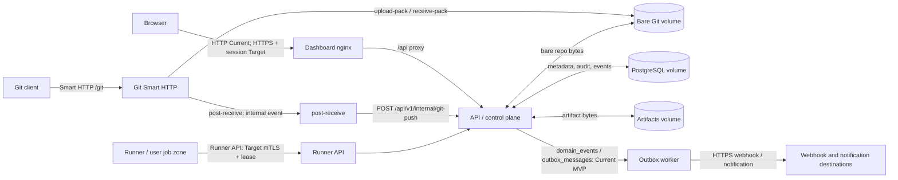

# Модель угроз Forge CI/CD

**Статус:** текущая модель угроз для single-node MVP; целевая архитектура обозначена как Target и не является реализованной функцией.

Этот документ выполняет ASVS 4.0 V1: модель угроз пересматривается при изменении системы (ASVS 1.1.2), фиксирует trust boundaries (ASVS 1.1.4) и потоки данных между ними (ASVS 1.1.5).

## 1. Методология и допущения

Модель применяет STRIDE к каждому переходу между зонами доверия:

| Категория | Вопрос для Forge |
|---|---|
| **S — Spoofing** | Может ли неаутентифицированный клиент, runner или внутренний компонент выдать себя за допустимого субъекта? |
| **T — Tampering** | Можно ли изменить Git-данные, pipeline, статусы, артефакт, событие или хранимые metadata? |
| **R — Repudiation** | Можно ли отрицать чувствительное действие без полного и неизменяемого audit evidence? |
| **I — Information disclosure** | Могут ли исходный код, секреты, токены, логи, артефакты или tenant-данные раскрыться другому субъекту? |
| **D — Denial of service** | Может ли входящий или внешний поток исчерпать сеть, CPU, память, storage, очередь либо worker? |
| **E — Elevation of privilege** | Может ли клиент получить права другого tenant/project, API control plane или Docker/host execution? |

### Периметр доверия

- **Current:** Forge разрешено размещать только в изолированной **trusted-network**. Это компенсирующее эксплуатационное ограничение, а не аутентификация: Dashboard, API и Git Smart HTTP не должны быть доступны недоверенной сети. Весь compose-хост, включая backend с Docker execution, считается одной доверенной зоной.
- **Target:** каждый внешний и межсервисный переход использует TLS; пользовательские и сервисные запросы проходят аутентификацию и scope/RBAC до чтения или изменения данных. Runner использует mTLS и scoped lease, а системные события -- signed credential, timestamp и one-time event ID.
- **Не считается доверенным:** браузер, Git client, код job, runner, webhook/notification destination и данные, поступающие от них. Даже в trusted-network они могут быть скомпрометированы.
- **Активы:** tenant/project metadata, исходный код и refs, pipeline/job state, job logs, artifacts, секреты и ключи, API/Git/internal/runner credentials, audit events, domain events/outbox и резервные копии.

## 2. Потоки данных и границы доверия

**Current topology:** nginx proxies `/api/` and `/git/` to the same backend; backend is также опубликован на `:22801`. `post-receive` вызывает backend по `http://127.0.0.1:22801`. Embedded runner находится в backend и может запускать Docker или host shell; при `CICD_EMBEDDED_RUNNER_ENABLED=false` работу может забирать отдельный `forge-runner` shell process через current runner API. Outbox worker уже работает для schedules/outgoing webhooks MVP.

## 3. STRIDE по границам

Статус означает: **Current** -- реализовано и подтверждено кодом; **Target** -- закреплено контрактом, но не реализовано; **отсутствует** -- требуемый контроль сейчас отсутствует. Ссылки на контракты являются нормативным целевым поведением.

| Граница и поток | STRIDE-угрозы | Контроли и статус | Контракт |
|---|---|---|---|
| Browser -> Dashboard nginx -> API (`/api`) | **S/E/I:** без `CICD_AUTH_SECRET` любой сетевой клиент получает API-доступ; project scope включается только вместе с auth. **T/R:** delivery routes требуют корректного project scope, но tenant boundary ещё не production-grade. **D:** in-process rate limit не защищает от распределённого flood или обхода forwarded headers. | Current: nginx proxy; SQLx parameter binding; request ID/error envelope; basic audit; conditional JWT/PAT enforcement, scoped PAT, session-bound access invalidation, project memberships для project-owned/name-based repo API и in-process rate limits для auth/API/Git/artifact classes. Target: TLS, CSRF для cookie, tenant filtering и service-account/runner credential classes. Отсутствует: production default-deny, tenant isolation, production CORS allowlist. | `AUTHZ_CONTRACT` §1, §2--§7; route policy §6 |
| Git client -> Smart HTTP -> bare Git volume | **S/E/I:** trusted-local режим всё ещё может отключить auth; legacy общий token не имеет tenant/scoped credential semantics; backend можно обойти напрямую, если порт опубликован. **T:** write без корректной роли должен блокироваться до Git I/O, иначе push меняет refs и запускает pipeline. **D:** неограниченные discovery/RPC запросы. | Current: валидация имени repo; public read only для public repo; private read/write через legacy `CICD_GIT_TOKEN` либо JWT/PAT + `project_memberships` + `git:*` PAT scopes при `CICD_AUTH_SECRET`; Git выполняется stateless RPC после policy. Target: отдельный scoped Git credential class, TLS, tenant-bound repository mapping и signed/audited Git denials. отсутствует: tenant-scoped Git credentials, rate/size limits, изоляция Git ingress от общего API. | `AUTHZ_CONTRACT` §1, §2, §5, §6 (Git routes); `EVENT_CONTRACT` §4 |
| Smart HTTP -> post-receive -> API (`/internal/git-push`) | **S/T:** shared internal token может быть пустым; token подставляется в generated hook и передаётся plaintext HTTP. Старый hook без `new_rev` всё ещё может создать лишний pipeline при повторе события. **R:** нет signed immutable event/audit linkage. **D:** hook best-effort скрывает сбой и допускает flood. | Current: проверка `x-internal-token`, когда `CICD_GIT_INTERNAL_TOKEN` непустой; compose больше не задаёт known dev default; legacy `forge-internal-dev-token` отклоняется при старте; валидация repo/ref; новый hook передаёт `old_rev/new_rev`; повтор того же `repository/ref/new_rev` дедуплицируется через `pipeline_triggers`; delete-ref не запускает pipeline. Target: `system` signed credential, timestamp, one-time event ID, immutable `domain_events` и full ingress event store. отсутствует: TLS/mTLS, constant-time credential handling, signed replay protection, transactional event/outbox. | `AUTHZ_CONTRACT` §2, §6; `EVENT_CONTRACT` §1, §2, §4 |
| Runner -> Runner API -> API | **S/E:** скомпрометированный runner может запросить чужую работу, секреты, logs или artifacts. **T/R:** stale runner пишет terminal state/log/artifact после retry. **I:** secret/lease попадает в storage или log. **D:** poll, artifact/log upload или renew истощает API. | Current: embedded runner запускается в backend; Docker mode использует `--network none`, `--cap-drop ALL`, read-only root FS, memory/PID limits; project secrets выдаются только по `jobs.required_secrets` и маскируются в stdout/stderr best-effort; declared artifacts берутся только из `jobs.artifact_paths`; external runner protocol MVP использует bootstrap registration token, bearer runner credential, hashed lease token, `workspace.checkoutUrl`, basic tag/current `shell` executor capability matching, ack/control/`secrets:resolve`/artifact upload/renew/logs/complete и fencing generation; `forge-runner` shell MVP может исполняться отдельным процессом, получать declared secrets после ack, загружать declared artifacts, poll-ить cancel signal и отправлять stdout/stderr в `job_logs` с masking. Target: production runner zone, TLS/mTLS, scoped lease HMAC/pepper, credential rotation/revoke, resumable artifact sessions, richer log chunks, rate limits, full redaction, KMS/rotation policy и Docker/Kubernetes sandbox. Отсутствует: production изоляция API от Docker socket, mTLS и full hardened protocol data planes. | `RUNNER_PROTOCOL` §1--§5; `AUTHZ_CONTRACT` §2, §6, §7 |
| API -> PostgreSQL volume | **T/I/E:** SQL/metadata, ciphertext secrets, audit и events доступны процессу с DB credential; скомпрометированный backend получает их все. **D:** connection/storage exhaustion. | Current: parameterized SQLx; committed SQLx migrations; secrets AES-256-GCM at rest; DB bound to localhost в compose; domain_events/outbox_messages для terminal delivery. Target: `forge_runtime` least privilege, schema `forge`, tenant predicates, stronger append-only guarantees и encrypted backup. Отсутствует: production DB role split, verified backup/restore и target tenant isolation. | `AUTHZ_CONTRACT` §1, §7; `EVENT_CONTRACT` §1; `DATA_LIFECYCLE` §1, §2, §4--§6 |
| API -> bare Git volume | **T/I/E:** backend или embedded job path может изменить/прочитать любой repository; удаление сразу удаляет directory. **D:** corrupt/oversize repo исчерпает volume. | Current: repo name allowlist и DB existence check перед Git service. Target: logical storage keys, server-side authorization/audit, quarantine, `git fsck`, dedicated Git storage policy. отсутствует: repository-to-project mandatory mapping, Git integrity monitoring, quarantine/retention lifecycle. | `AUTHZ_CONTRACT` §1, §5, §6; `DATA_LIFECYCLE` §1, §2, §3--§5 |
| API -> artifacts volume -> download | **T/I/E:** отсутствие auth позволяет читать/загружать artifacts по ID и job ID; `storage_path` из DB больше не считается доверенным, но metadata-компрометация всё ещё может ломать доступность конкретного artifact. Filename ограничен path/header-опасными символами. **D:** upload ограничен 50 MiB и in-process rate limit, но quota/retention отсутствуют. | Current: UUID storage filename для новых uploads; запрет `/`, `\\`, quote и control chars в artifact name; 50 MiB request limit; route-class rate limit; download canonicalize-ит artifact root и stored path, затем возвращает `404`, если файл вне root, и `409`, если bytes не совпадают с SHA-256 metadata. Target: server-side authorization до I/O в production, tenant/project storage key, immutable object/version, state/retention/hold checks, quotas and malware/content policy. Отсутствует: tenant isolation, retention/quota lifecycle and immutable object state. | `AUTHZ_CONTRACT` §1, §5, §6; `DATA_LIFECYCLE` §1--§4 |
| Outbox worker -> webhooks/notifications | **S/T/I:** SSRF, redirect или destination impersonation для внешних destinations; неверно настроенный secret раскрывает доверие получателя; payload может унести лишние metadata. **R:** bounded history уже фиксирует attempts/outcome, но без lease/crash-safe dispatcher-а остаётся риск спорного результата после сбоя. **D:** slow receiver и retries блокируют delivery. | Current: outgoing webhooks MVP через domain_events/outbox_messages, basic retry/backoff, optional HMAC, project-scoped delivery history и failed requeue; `in_app`/`sse` notifications создают local outbox history/stream и не отправляют внешние HTTP/SMTP сообщения. Target: TLS-only production URL, destination validation, lease/fencing, full dead-letter policy/metrics and audit. Отсутствует: full runtime controls, external notification delivery и production operator workflow для replay/dead-letter. | `EVENT_CONTRACT` §1--§7; `AUTHZ_CONTRACT` §1, §5, §7 |

## 4. Приоритетные текущие риски и план снижения

| Приоритет | Риск и последствия | План mitigation | Критерий закрытия |
|---:|---|---|---|
| P0 | **Auth/RBAC условны и ещё не production-safe.** При непустом `CICD_AUTH_SECRET` работают login/JWT/PAT, scoped PAT, session-bound access invalidation, refresh rotate/logout/revoke, route roles, project memberships и Git Smart HTTP read/write checks; без секрета API/Dashboard остаются trusted-network/open. Tenant isolation, service-account tokens, scoped Git credentials и production cookie/CSRF/session-family policy ещё не завершены. | До shared-поставки: требовать непустой `CICD_AUTH_SECRET`, firewall/VPN и запрет публичной публикации API, Dashboard, Git и PostgreSQL. Затем завершить `AUTHZ_CONTRACT`: service-account/runner credentials, tenant/project filtering для всех вертикалей, tenant-bound Git mapping, route-policy inventory и production CORS/CSRF. | Каждый route из `AUTHZ_CONTRACT` §6 возвращает 401/403/404 корректно; negative tests доказывают tenant isolation; production CORS/CSRF policy включена. |
| P0 | **Plaintext internal token.** Если `CICD_GIT_INTERNAL_TOKEN` задан, он передаётся HTTP и записывается в generated `post-receive` hook; пустой trusted-local режим всё ещё опасен вне изолированного dev. | Немедленно требовать уникальный secret вне VCS и ограничить localhost permissions. Целевое исправление: отдельный локальный protected channel либо mTLS/signed одноразовый system event с timestamp; удалить token из hook text. | Compose не задаёт known dev default; legacy default отклоняется при старте; target replay/invalid signature test проходит; raw token отсутствует в repo, logs и generated hook. |
| P0 | **Secrets в environment.** DB password, Git/internal tokens и master key доступны процессу backend и могут раскрыться через process inspection, crash/debug output или job при ошибочной изоляции. | Использовать secret manager/Compose secrets с read-only files, least-privilege runtime identity, rotation и запрет secret в logs/images. Изолировать runner от API process согласно ADR-0007. | Runtime не получает plaintext, который ему не нужен; rotation/incident procedure проверена; secret scan и redaction tests green. |
| P1 | **Rate limiting ещё single-node.** Current in-process limiter снижает naive flood для auth, API, Git Smart HTTP, internal hook и artifact upload, но не защищает от распределённой атаки, прямого обхода trusted proxy headers и restart reset. | Добавить reverse-proxy и distributed application limits: body/time/concurrency; per-IP и per-principal `429`; отдельные строгие лимиты для trigger, Git, artifact, runner logs/poll. | Нагрузочные/contract tests подтверждают bounded behavior и `429`; метрики не содержат sensitive IDs; distributed counters не сбрасываются при restart. |
| P1 | **Artifact integrity/retention ещё неполные.** Download уже не читает `storage_path` вне artifact root и сверяет SHA-256 для новых uploads, но legacy rows могут быть без digest; immutable object state, tenant-scoped storage key, quota и retention lifecycle отсутствуют. | Не хранить absolute path как authority: перейти на immutable storage key/UUID, tenant/project scope, quota/retention/hold и reconciler checksum policy. | Tests: forged `storage_path` не читает файл вне root; checksum drift даёт `409`; target authorized download сверяет scope/state/checksum/retention. |
| P1 | **Git protocol не изолирован полностью.** `/git` и `/api` обслуживает один backend; legacy Git token остаётся optional/global, direct backend port опубликован, current mapping выводится из URL suffix. | Закрыть direct backend port внешней сети; выделить Git ingress/proxy policy, TLS и scoped Git credentials; заменить URL suffix lookup tenant-bound mapping, ограничить request size/concurrency и audit push/denial. | Git routes требуют `repository.read`/`repository.write`; обход nginx/ingress невозможен; policy и denial audited. |

## 5. Изменение модели

Каждый новый или изменённый ADR, контракт, endpoint, worker, storage adapter либо integration, который создаёт **новую trust boundary**, меняет data flow или меняет доверие к субъекту/credential, обязан в том же изменении обновить `docs/THREAT_MODEL.md`:

1. добавить boundary и flow в диаграмму;
2. добавить/изменить STRIDE-строки и статус контролей;
3. связать нормативные разделы контрактов и tests/evidence;
4. пересмотреть приоритет рисков и mitigation.

Изменение не считается завершённым без этой проверки модели угроз; это дополняет mandatory change impact в `docs/ARCHITECTURE_INDEX.md`.

## Связанные источники

- `docs/SECURITY.md` -- текущий security status и переходные эксплуатационные ограничения.
- `docs/architecture/runtime-topology.md` -- current/target runtime topology.
- `docs/GIT_HOSTING.md` -- Smart HTTP и `post-receive` flow.
- `docs/contracts/AUTHZ_CONTRACT.md` -- target identity, policy и audit.
- `docs/contracts/RUNNER_PROTOCOL.md` -- target runner boundary.
- `docs/contracts/EVENT_CONTRACT.md` -- target outbox и external delivery.
- `docs/contracts/DATA_LIFECYCLE.md` -- storage, access, integrity и retention.
