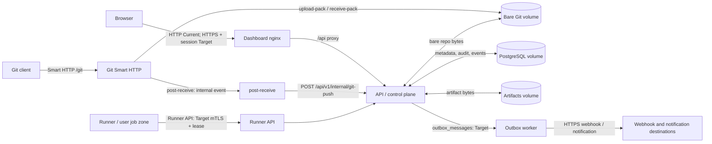

# Модель угроз Forge CI/CD

**Статус:** текущая модель угроз для single-node MVP; целевая архитектура обозначена как Target и не является реализованной функцией.

Этот документ выполняет ASVS 4.0 V1: модель угроз пересматривается при изменении системы (ASVS 1.1.2), фиксирует trust boundaries (ASVS 1.1.4) и потоки данных между ними (ASVS 1.1.5).

## 1. Методология и допущения

Модель применяет STRIDE к каждому переходу между зонами доверия:

| Категория | Вопрос для Forge |
|---|---|
| **S — Spoofing** | Может ли неаутентифицированный клиент, runner или внутренний компонент выдать себя за допустимого субъекта? |
| **T — Tampering** | Можно ли изменить Git-данные, pipeline, статусы, артефакт, событие или хранимые metadata? |
| **R — Repudiation** | Можно ли отрицать чувствительное действие без полного и неизменяемого audit evidence? |
| **I — Information disclosure** | Могут ли исходный код, секреты, токены, логи, артефакты или tenant-данные раскрыться другому субъекту? |
| **D — Denial of service** | Может ли входящий или внешний поток исчерпать сеть, CPU, память, storage, очередь либо worker? |
| **E — Elevation of privilege** | Может ли клиент получить права другого tenant/project, API control plane или Docker/host execution? |

### Периметр доверия

- **Current:** Forge разрешено размещать только в изолированной **trusted-network**. Это компенсирующее эксплуатационное ограничение, а не аутентификация: Dashboard, API и Git Smart HTTP не должны быть доступны недоверенной сети. Весь compose-хост, включая backend с Docker execution, считается одной доверенной зоной.
- **Target:** каждый внешний и межсервисный переход использует TLS; пользовательские и сервисные запросы проходят аутентификацию и scope/RBAC до чтения или изменения данных. Runner использует mTLS и scoped lease, а системные события -- signed credential, timestamp и one-time event ID.
- **Не считается доверенным:** браузер, Git client, код job, runner, webhook/notification destination и данные, поступающие от них. Даже в trusted-network они могут быть скомпрометированы.
- **Активы:** tenant/project metadata, исходный код и refs, pipeline/job state, job logs, artifacts, секреты и ключи, API/Git/internal/runner credentials, audit events, domain events/outbox и резервные копии.

## 2. Потоки данных и границы доверия

**Current topology:** nginx proxies `/api/` and `/git/` to the same backend; backend is также опубликован на `:22801`. `post-receive` вызывает backend по `http://127.0.0.1:22801`. Embedded runner находится в backend и может запускать Docker или host shell. Outbox worker и runner API -- Target.

## 3. STRIDE по границам

Статус означает: **Current** -- реализовано и подтверждено кодом; **Target** -- закреплено контрактом, но не реализовано; **отсутствует** -- требуемый контроль сейчас отсутствует. Ссылки на контракты являются нормативным целевым поведением.

| Граница и поток | STRIDE-угрозы | Контроли и статус | Контракт |
|---|---|---|---|
| Browser -> Dashboard nginx -> API (`/api`) | **S/E/I:** любой сетевой клиент получает API-доступ; cookie/session отсутствуют. **T/R:** изменяющие вызовы не связываются с проверенным principal. **D:** flood и brute force без лимитов. | Current: nginx proxy; SQLx parameter binding; базовый audit. Target: TLS, JWT/session, CSRF для cookie, RBAC и tenant/project filtering. отсутствует: auth enforcement, RBAC, production CORS allowlist, rate limit. | `AUTHZ_CONTRACT` §1, §2--§7; route policy §6 |
| Git client -> Smart HTTP -> bare Git volume | **S/E/I:** token опционален, один общий token не имеет repository/project scope; backend можно обойти напрямую. **T:** неавторизованный push меняет refs и запускает pipeline. **D:** неограниченные discovery/RPC запросы. | Current: валидация имени repo; optional `CICD_GIT_TOKEN`; Git выполняется stateless RPC. Target: Git credential с `repository.read`/`repository.write`, TLS, project binding и policy до Git I/O. отсутствует: per-repository RBAC, rate/size limits, изоляция Git ingress от общего API. | `AUTHZ_CONTRACT` §1, §2, §5, §6 (Git routes); `EVENT_CONTRACT` §4 |
| Smart HTTP -> post-receive -> API (`/internal/git-push`) | **S/T:** shared internal token может быть пустым; token подставляется в generated hook и передаётся plaintext HTTP. Повтор события может создавать лишние pipeline. **R:** нет signed immutable event/audit linkage. **D:** hook best-effort скрывает сбой и допускает flood. | Current: проверка `x-internal-token`, когда `CICD_GIT_INTERNAL_TOKEN` непустой; валидация repo/ref. Target: `system` signed credential, timestamp, one-time event ID, immutable `domain_events` и ingress idempotency. отсутствует: TLS/mTLS, constant-time credential handling, replay protection, transactional event/outbox. | `AUTHZ_CONTRACT` §2, §6; `EVENT_CONTRACT` §1, §2, §4 |
| Runner (target) -> Runner API -> API | **S/E:** скомпрометированный runner может запросить чужую работу, секреты, logs или artifacts. **T/R:** stale runner пишет terminal state/log после retry. **I:** secret/lease попадает в storage или log. **D:** poll, log upload или renew истощает API. | Current: embedded runner запускается в backend; Docker mode использует `--network none`, `--cap-drop ALL`, read-only root FS, memory/PID limits. Target: отдельная runner zone, TLS/mTLS, registration token, scoped lease HMAC, fencing, rate limits, secret redaction. отсутствует: внешний runner protocol, leases, mTLS, secret injection/redaction и изоляция API от Docker socket. | `RUNNER_PROTOCOL` §1--§5; `AUTHZ_CONTRACT` §2, §6, §7 |
| API -> PostgreSQL volume | **T/I/E:** SQL/metadata, ciphertext secrets, audit и events доступны процессу с DB credential; скомпрометированный backend получает их все. **D:** connection/storage exhaustion. | Current: parameterized SQLx; secrets AES-256-GCM at rest; DB bound to localhost в compose. Target: `forge_runtime` least privilege, schema `forge`, tenant predicates, append-only audit/event/outbox и encrypted backup. отсутствует: runtime DB role split, versioned migrations, verified backup/restore и target tenant isolation. | `AUTHZ_CONTRACT` §1, §7; `EVENT_CONTRACT` §1; `DATA_LIFECYCLE` §1, §2, §4--§6 |
| API -> bare Git volume | **T/I/E:** backend или embedded job path может изменить/прочитать любой repository; удаление сразу удаляет directory. **D:** corrupt/oversize repo исчерпает volume. | Current: repo name allowlist и DB existence check перед Git service. Target: logical storage keys, server-side authorization/audit, quarantine, `git fsck`, dedicated Git storage policy. отсутствует: repository-to-project mandatory mapping, Git integrity monitoring, quarantine/retention lifecycle. | `AUTHZ_CONTRACT` §1, §5, §6; `DATA_LIFECYCLE` §1, §2, §3--§5 |
| API -> artifacts volume -> download | **T/I/E:** отсутствие auth позволяет читать/загружать artifacts по ID и job ID; `storage_path` из DB читается без containment check, поэтому компрометация metadata может привести к path traversal/read outside artifact root. Filename ограничен только `/` и `\\`. **D:** upload ограничен 50 MiB, но нет quota/rate limit. | Current: UUID storage filename для новых uploads; запрет `/` и `\\` в artifact name; 50 MiB request limit. Target: server-side authorization до I/O, tenant/project storage key, SHA-256, immutable object/version, state/retention/hold checks. отсутствует: storage-path containment validation, tenant isolation, checksum, quotas/retention and malware/content policy. | `AUTHZ_CONTRACT` §1, §5, §6; `DATA_LIFECYCLE` §1--§4 |
| Outbox worker (target) -> webhooks/notifications | **S/T/I:** SSRF, redirect или destination impersonation; unsigned body раскрывает event; secrets могут попасть в payload. **R:** потерянный/replayed delivery без durable evidence. **D:** slow receiver и retries блокируют delivery. | Current: configuration-only -- worker и delivery отсутствуют. Target: transactional outbox, TLS-only production URL, destination validation, HMAC, delivery ID, retry/backoff, dead-letter and audit. отсутствует: все runtime controls доставки. | `EVENT_CONTRACT` §1--§7; `AUTHZ_CONTRACT` §1, §5, §7 |

## 4. Приоритетные текущие риски и план снижения

| Приоритет | Риск и последствия | План mitigation | Критерий закрытия |
|---:|---|---|---|
| P0 | **Нет auth/RBAC: Spoofing на всех API.** Любой, кто достигает API/Dashboard, может читать и изменять проекты, pipelines, secrets metadata, artifacts и пользователей. | До поставки: firewall/VPN и запрет публичной публикации API, Dashboard, Git и PostgreSQL. Затем реализовать `AUTHZ_CONTRACT`: JWT/session, PAT/SAT HMAC storage, middleware, tenant/project filtering и route-policy tests. | Каждый route из `AUTHZ_CONTRACT` §6 возвращает 401/403/404 корректно; negative tests доказывают tenant isolation; production CORS allowlist включён. |
| P0 | **Plaintext internal token.** `CICD_GIT_INTERNAL_TOKEN` передаётся HTTP и записывается в generated `post-receive` hook; default development token опасен для shared deployment. | Немедленно требовать уникальный secret вне VCS и ограничить localhost permissions. Целевое исправление: отдельный локальный protected channel либо mTLS/signed одноразовый system event с timestamp; удалить token из hook text. | Empty/default token отклоняется вне development; replay/invalid signature test проходит; raw token отсутствует в repo, logs и generated hook. |
| P0 | **Secrets в environment.** DB password, Git/internal tokens и master key доступны процессу backend и могут раскрыться через process inspection, crash/debug output или job при ошибочной изоляции. | Использовать secret manager/Compose secrets с read-only files, least-privilege runtime identity, rotation и запрет secret в logs/images. Изолировать runner от API process согласно ADR-0007. | Runtime не получает plaintext, который ему не нужен; rotation/incident procedure проверена; secret scan и redaction tests green. |
| P1 | **Отсутствует rate limiting.** API, Git Smart HTTP, upload и будущие auth/runner endpoints доступны для resource exhaustion. | Добавить reverse-proxy и application limits: body/time/concurrency; per-IP и per-principal `429`; отдельные строгие лимиты для auth, trigger, Git, artifact, runner logs/poll. | Нагрузочные/contract tests подтверждают bounded behavior и `429`; метрики не содержат sensitive IDs. |
| P1 | **Artifact path traversal / trusted storage path.** Новый upload получает UUID path, но download доверяет `artifacts.storage_path`; подмена metadata способна читать произвольный доступный backend path. | Не хранить absolute path как authority: вывести path только из immutable storage key/UUID; canonicalize и проверять containment перед read/delete; хранить digest и tenant/project scope. | Test с forged `storage_path` не читает файл вне root; authorized download сверяет scope/state/checksum. |
| P1 | **Git protocol не изолирован.** `/git` и `/api` обслуживает один backend; Git token optional/global, direct backend port опубликован, repo-level policy отсутствует. | Закрыть direct backend port внешней сети; выделить Git ingress/proxy policy, TLS и scoped Git credentials; привязать repository к project/tenant, ограничить request size/concurrency и audit push. | Git routes требуют `repository.read`/`repository.write`; обход nginx/ingress невозможен; policy и denial audited. |

## 5. Изменение модели

Каждый новый или изменённый ADR, контракт, endpoint, worker, storage adapter либо integration, который создаёт **новую trust boundary**, меняет data flow или меняет доверие к субъекту/credential, обязан в том же изменении обновить `docs/THREAT_MODEL.md`:

1. добавить boundary и flow в диаграмму;
2. добавить/изменить STRIDE-строки и статус контролей;
3. связать нормативные разделы контрактов и tests/evidence;
4. пересмотреть приоритет рисков и mitigation.

Изменение не считается завершённым без этой проверки модели угроз; это дополняет mandatory change impact в `docs/ARCHITECTURE_INDEX.md`.

## Связанные источники

- `docs/SECURITY.md` -- текущий security status и переходные эксплуатационные ограничения.
- `docs/architecture/runtime-topology.md` -- current/target runtime topology.
- `docs/GIT_HOSTING.md` -- Smart HTTP и `post-receive` flow.
- `docs/contracts/AUTHZ_CONTRACT.md` -- target identity, policy и audit.
- `docs/contracts/RUNNER_PROTOCOL.md` -- target runner boundary.
- `docs/contracts/EVENT_CONTRACT.md` -- target outbox и external delivery.
- `docs/contracts/DATA_LIFECYCLE.md` -- storage, access, integrity и retention.
