# Руководство пользователя Forge CI/CD

Forge CI/CD - self-hosted control plane для Git-репозиториев и CI/CD. Руководство предназначено для разработчиков, владельцев проектов и администраторов инстанса. Технические контракты API принадлежат `docs/API.md`; проверенное текущее состояние - `docs/CURRENT_STATE.md`.

## 1. Обзор продукта и статусы

### Как читать статусы

- **Current verified** - возможность работает в текущей версии и подтверждена кодом.
- **Configuration only** - форму и хранение конфигурации можно использовать, но её исполнение или доставка ещё не реализованы.
- **Target approved** - возможность принята в ADR/контракте, но пока не реализована.

### Что доступно сейчас

| Возможность | Статус | Практическая граница |
|---|---|---|
| Проекты, pipelines, jobs, attempts, логи | **Current verified** | Создание, просмотр, отмена и повтор; retry сохраняет историю attempts/logs, embedded runner выполняет jobs в Docker или host shell. |
| Git Smart HTTP и auto-trigger | **Current verified** | Локальный bare-репозиторий, `clone`/`fetch`/`push`; private/write доступ проверяется через Git token или project membership, push создаёт pipeline у связанного проекта. |
| Артефакты | **Current verified MVP** | Локальное хранение, upload/download, до 50 MiB на файл, SHA-256 для новых uploads. |
| Секреты проекта | **Current verified** | AES-256-GCM at rest; embedded runner передаёт их в env и маскирует значения в stdout/stderr logs. |
| Окружения и записи деплоев | **Current verified** | Метаданные окружения и история деплоев; выполнение деплоя определяется job. |
| Отчёты и аудит | **Current verified** | Сводка по проекту и последние 200 событий аудита. |
| Пользователи, участники проектов и API-токены | **Current verified MVP** | Хранение, argon2id credentials, session-bound access JWT, sessions, PAT enforcement и project memberships при `CICD_AUTH_SECRET`. |
| Расписания и outgoing webhooks | **Current verified MVP** | Worker запускает enabled schedules по строгому 5-польному UTC cron и доставляет terminal pipeline webhooks с basic retry. |
| Уведомления (`in_app`/`sse`) | **Current verified MVP** | Каналы показывают terminal pipeline events в Dashboard history/stream. |
| Email/Slack adapters и inbound provider webhooks | **Target approved** | Внешние уведомления и public provider webhook handlers ещё не исполняют доставку. |
| Вход, сессии, RBAC | **Current verified conditional** | `/login` работает при непустом `CICD_AUTH_SECRET`; project-owned API проверяет active session, текущую роль и membership, без секрета API и Dashboard остаются trusted-network/open. |

> **Безопасность:** для общего окружения задайте `CICD_AUTH_SECRET`, закройте API/Dashboard reverse proxy или сетью и не запускайте Git endpoint в trusted-local режиме без `CICD_AUTH_SECRET`/`CICD_GIT_TOKEN`; обязательно замените dev-значение `CICD_GIT_INTERNAL_TOKEN`.

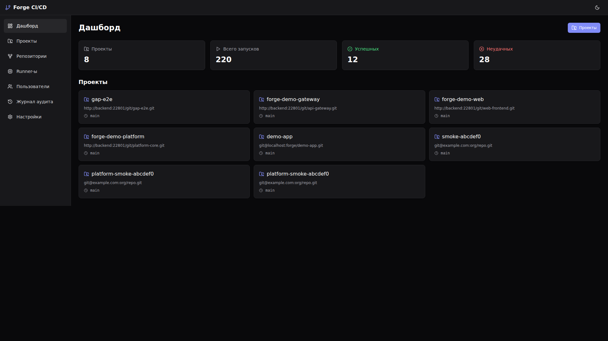

## 2. Вход

**Статус процедуры: Current verified conditional.**

1. Откройте `/login`.
2. Если backend запущен с `CICD_AUTH_SECRET`, форма отправляет `POST /api/v1/auth/login`, сохраняет access/refresh token и переводит в Dashboard.
3. Если `CICD_AUTH_SECRET` не задан или пустой, backend не требует principal, а UI не будет воспринимать `/login` как boundary доступа. Для shared-инстанса задайте секрет и закройте сервис reverse proxy/сетью.

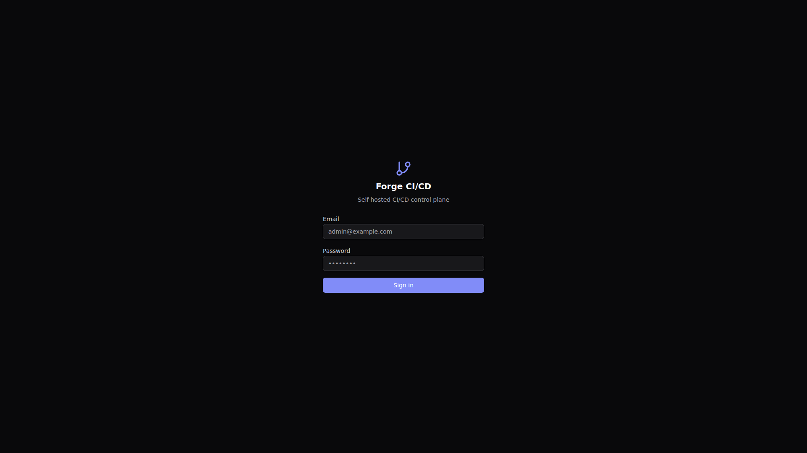

## 3. Создание проекта

**Статус процедуры: Current verified.**

Проект связывает репозиторий с pipelines, секретами, окружениями, отчётами и другими project-scoped ресурсами.

1. Откройте **Projects** (`/projects`) и выберите **Create project**.
2. Укажите уникальное имя, `repository_url` и default branch. Для локального Git-хостинга используйте URL вида `http://<host>:22802/git/<repo>.git` через Dashboard/Git proxy; прямой backend Git endpoint также доступен как `http://<host>:22801/git/<repo>.git`.
3. Создайте проект и сохраните его UUID: он нужен для CLI и прямых запросов API.
4. Откройте страницу проекта и перейдите к pipelines или соответствующему ресурсу.

Если bare-репозитория ещё нет, сначала создайте его в **Repositories** (`/repositories`) с именем `<repo>`. Имя допускает ASCII-буквы/цифры, `-`, `_` и `.`; суффикс `.git` можно не вводить.

```bash
# Создать bare-репозиторий.
curl -fsS -X POST http://127.0.0.1:22801/api/v1/repositories \
  -H 'content-type: application/json' \
  -d '{"name":"my-service"}'

# Связать его с проектом.
curl -fsS -X POST http://127.0.0.1:22801/api/v1/projects \
  -H 'content-type: application/json' \
  -d '{
    "name":"my-service",
    "repository_url":"http://127.0.0.1:22802/git/my-service.git",
    "default_branch":"main"
  }'
```

Удаление проекта каскадно удаляет его pipeline-данные и project-scoped записи, но не удаляет bare-репозиторий. Репозиторий удаляется отдельно через **Repositories** или `DELETE /api/v1/repositories/{name}`.

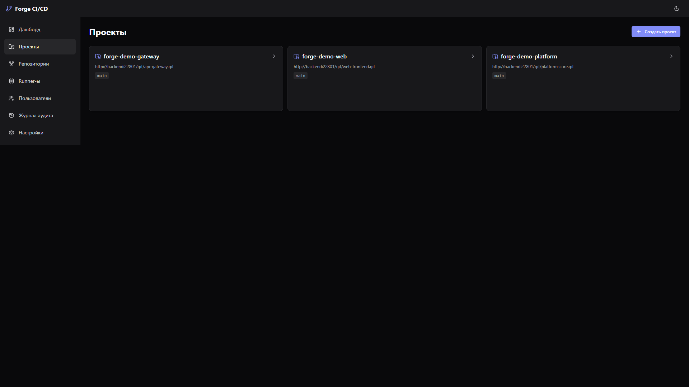

### Участники проекта

**Статус процедуры: Current verified MVP.**

При включённом `CICD_AUTH_SECRET` список проектов фильтруется по `project_memberships`: `admin` видит всё, остальные пользователи видят только назначенные проекты. Эффективные права ограничены и глобальной ролью пользователя, и ролью в проекте.

1. Откройте **Projects** и выберите **Members** у нужного проекта.
2. Назначьте пользователю роль `maintainer`, `developer` или `viewer`.
3. Используйте `maintainer` для управления участниками и секретами проекта; `developer` — для запуска и изменения рабочих ресурсов; `viewer` — для чтения.
4. Удаляйте ненужные memberships через список. Последнего maintainer удалить нельзя.

Tenant isolation, service-account tokens, tenant-bound Git mapping, scoped Git credentials и production cookie/CSRF/session-family policy остаются **Target approved**; scoped PAT, session-bound access invalidation, refresh logout/revoke и Git Smart HTTP read/write checks по linked repository URL уже выполняются сервером.

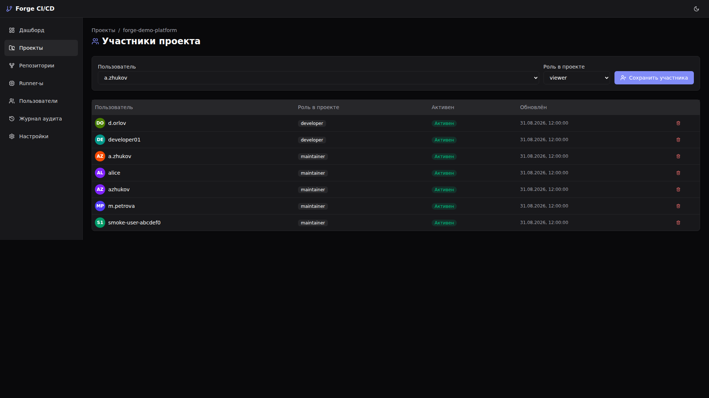

## 4. Push в репозиторий и авто-триггер pipeline

**Статус процедуры: Current verified.**

Auto-trigger работает для репозитория, созданного Forge, если `repository_url` проекта оканчивается на имя этого локального репозитория. `post-receive` hook отправляет pushed ref и `old_rev/new_rev` внутреннему API и создаёт queued pipeline. Повтор того же push-event с тем же `new_rev` возвращает уже созданный pipeline, а ошибка hook-доставки не откатывает Git push.

1. Создайте репозиторий и связанный проект по предыдущему разделу.
2. Клонируйте URL, добавьте commit и отправьте его в нужную ветку.
3. Откройте **Pipelines** проекта. Для `refs/heads/main` pipeline получит `git_ref` `main`; для тега будет использовано имя тега.
4. Если pipeline не появился, проверьте точное соответствие локального URL проекта и имени bare-репозитория, затем health API и `CICD_GIT_INTERNAL_TOKEN`.

```bash
# Для trusted local development без CICD_AUTH_SECRET/CICD_GIT_TOKEN доступ открыт.
git clone http://127.0.0.1:22802/git/my-service.git
cd my-service
git switch -c main
echo '# My service' > README.md
git add README.md
git commit -m 'Initial commit'
git push -u origin main
```

Если задан `CICD_GIT_TOKEN`, передайте его как пароль Basic auth (username произвольный). При включённом `CICD_AUTH_SECRET` вместо shared Git token можно передать access JWT или PAT пользователя; read требует `viewer+` в связанном проекте, push требует `developer+`. Для PAT дополнительно нужны scopes `git:read` для clone/fetch и `git:write` для push.

```bash
git clone http://any-user:<TOKEN>@<host>/git/my-service.git
```

Pipeline читает `.forge-ci.yml`, если он доступен в локальном bare repository; иначе используется шаблон build/test/deploy. Поддерживаются две формы: legacy `stages` с jobs, `image`, одиночным `command`, basic `timeout`, `allow_failure` и `manual`; а также v1 DAG MVP с `version: 1`, top-level `jobs`, `commands`, `needs`, `tags`, `secrets`, `artifacts.paths`, defaults `image/timeout/tags` и `allow_failure`. V1 `tags` попадают в `required_tags`, external runner получает только совместимую работу по tags и current `shell` executor capability; `jobs.*.secrets` попадает в `required_secrets`, и runner получает только эти project secrets; `jobs.*.artifacts.paths` попадает в `artifact_paths`, и embedded/external runner загружает только эти relative file paths после выполнения команд. Protected tags/pools/advanced capabilities, ключи `on`, retry, `artifacts.expire_in`, directory/glob upload и per-job/per-project retention policy остаются **Target approved**, см. `docs/contracts/PIPELINE_DSL.md`; глобальный TTL новых артефактов через `CICD_ARTIFACT_RETENTION_DAYS` уже работает.

```yaml
stages:
  - name: build
    jobs:
      - name: compile
        image: rust:1.86
        command: cargo build --release
  - name: test
    jobs:
      - name: unit-tests
        image: rust:1.86
        command: cargo test
```

## 5. Просмотр pipeline, логов и артефактов

### Pipeline и jobs

**Статус процедуры: Current verified.**

1. Откройте **Projects**, выберите проект и перейдите к **Pipelines** (`/projects/{projectId}/pipelines`).
2. Выберите запуск, чтобы открыть карточки stages и jobs (`/pipelines/{pipelineId}`).
3. Следите за статусом: `queued`, `running`, `success`, `failed`, `canceled`.
4. При необходимости отмените pipeline; повторите весь pipeline или отдельную terminal job доступной кнопкой **Retry**.

Детали pipeline также показывают **План запуска**: источник config (`repository` или `legacy_template`), parser version, resolved commit SHA, количество dependency edges и SHA-256 для raw config/normalised plan. Для v1 plan snapshot хранит `jobs.needs`, `required_tags`, `required_secrets`, `artifact_paths` и dependency edges, но current runner исполняет DAG через топологические стадии `dag-*`; policy snapshot, line/column parser diagnostics и job-level dispatcher остаются target.

Embedded runner каждые две секунды выбирает доступные queued jobs, выполняет их последовательно по stages, пишет stdout/stderr в append-only log текущей `execution_attempt` и устанавливает результат по exit code. Статусы stage и pipeline агрегируются автоматически. Retry pipeline или отдельной terminal job создаёт новую attempt и сохраняет логи предыдущих attempts. Terminal job card в деталях pipeline показывает latest attempt diagnostic (`error_tail`), если он есть. Для диагностики можно вручную менять статус job через UI, API или CLI, но это не заменяет фактическое выполнение.

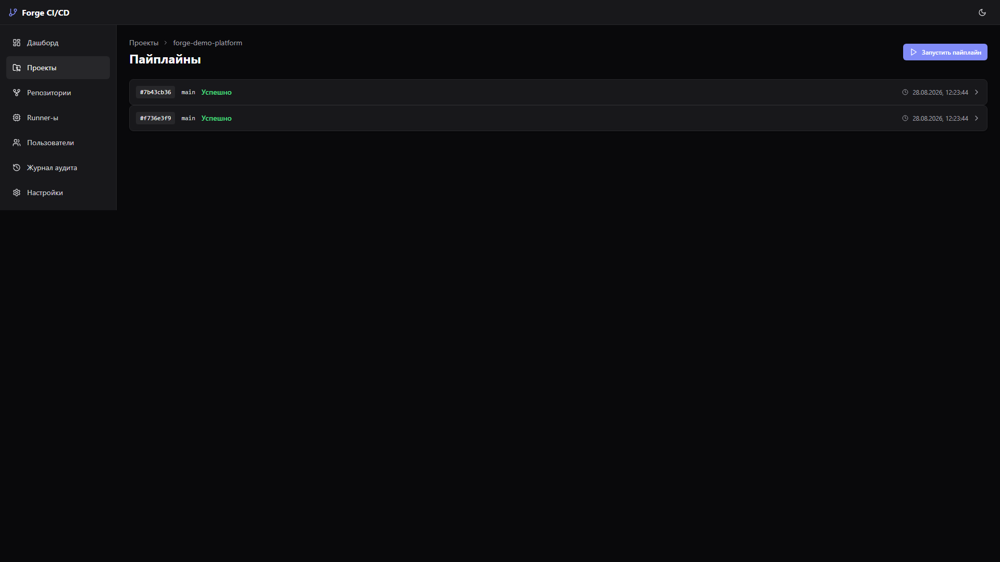

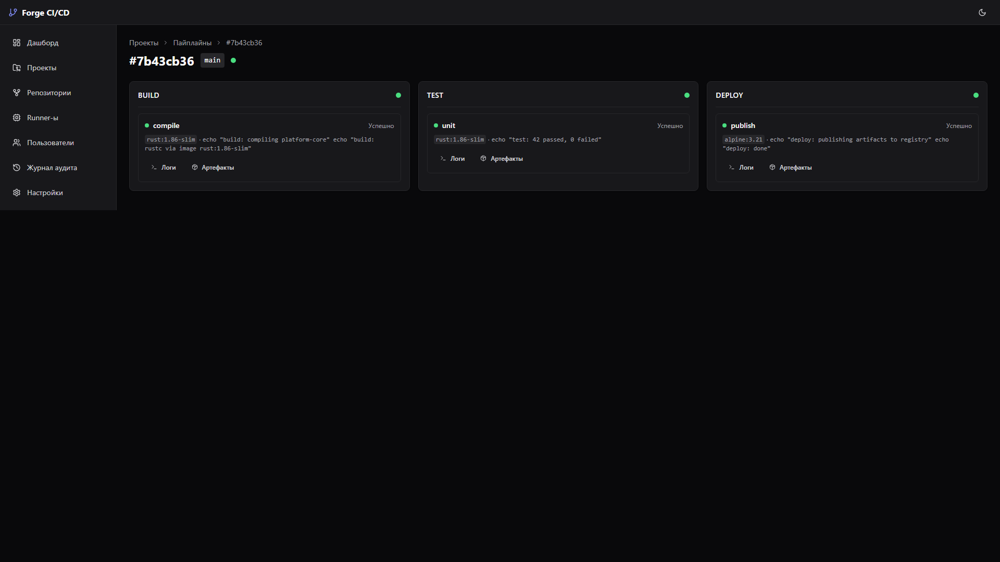

### Логи

**Статус процедуры: Current verified.**

1. В деталях pipeline выберите job и откройте **Logs**.
2. При наличии retry выберите нужную attempt: каждая attempt хранит собственные timestamps, terminal result и sequence логов.
3. Для API используйте `GET /api/v1/jobs/{job_id}/attempts`, затем `GET /api/v1/jobs/{job_id}/attempts/{attempt_id}/logs`. Совместимый `GET /api/v1/jobs/{job_id}/logs` возвращает текущую open attempt, а если её нет — последнюю.
4. Для live-tail доступен `GET /api/v1/jobs/{job_id}/logs/stream?after=<sequence>` по текущей/последней attempt.
5. При анализе ошибки сначала проверьте diagnostic на terminal job card, затем сопоставьте последнюю строку лога с image и command job; панель логов читает строки страницами и поддерживает поиск, а более богатые command spans и stream classification остаются target diagnostic logs.

> Значения project secrets передаются runner-у только для имён, объявленных job в `secrets`, и маскируются в stdout/stderr logs best-effort. Всё равно не выводите секреты намеренно: target redaction во всех audit/error/trace каналах ещё не завершён.

### Артефакты

**Статус процедуры: Current verified.**

1. Откройте **Artifacts** для job (`/jobs/{jobId}/artifacts`).
2. Загрузите файл через UI либо отправьте raw body с заголовком `X-Artifact-Name`.
3. Сверьте SHA-256 в списке при расследовании повреждения или переноса backup.
4. Скачайте сохранённый файл по ссылке в списке.
5. Учитывайте лимит 50 MiB на один файл и локальный характер хранилища `CICD_ARTIFACTS_DIR`.

```bash
# Загрузить файл артефакта.
curl -fsS -X POST "http://127.0.0.1:22801/api/v1/jobs/$JOB_ID/artifacts" \
  -H 'X-Artifact-Name: test-report.txt' \
  --data-binary @test-report.txt

# Посмотреть метаданные.
curl -fsS "http://127.0.0.1:22801/api/v1/jobs/$JOB_ID/artifacts"
```

Retention/TTL уже работает для новых локальных uploads через `CICD_ARTIFACT_RETENTION_DAYS`, `expires_at` и purge worker. S3/object storage, legal hold, quotas, directory/glob upload и multipart/resumable sessions - **Target approved**.

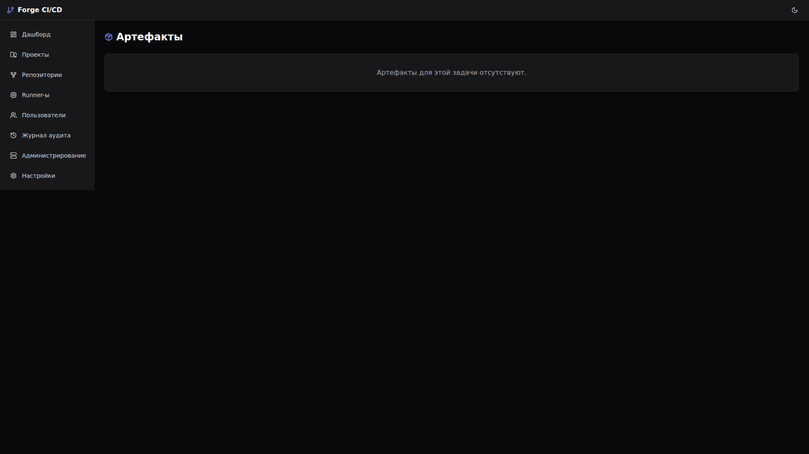

### Репозиторий и pull-запрос

Страница репозитория открывает вкладку **Код** с деревом bare Git-репозитория и безопасным preview текстовых файлов. Для файлов больше 512 KiB и бинарных файлов preview намеренно не отображается.

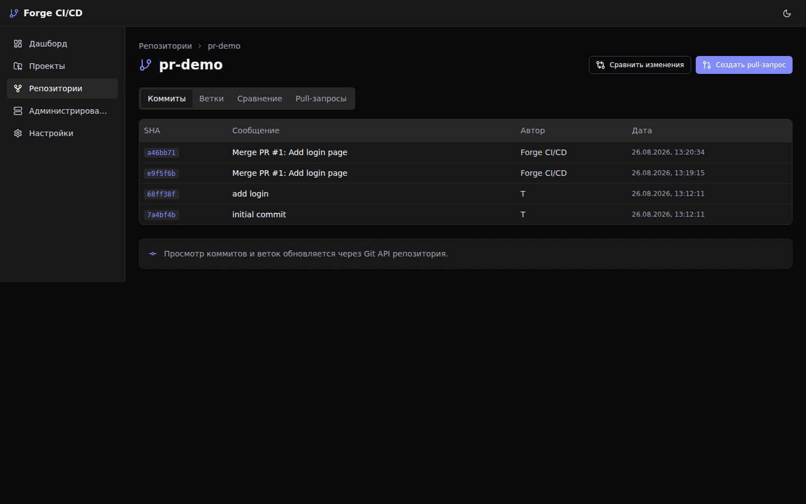

Карточка pull request показывает автора, source/target ветки и действия merge/close. Кнопка «Посмотреть изменения» сохраняет контекст конкретного PR: номер, заголовок, ветки, merge-base, список файлов и patch; кнопка возврата ведёт обратно в этот PR.

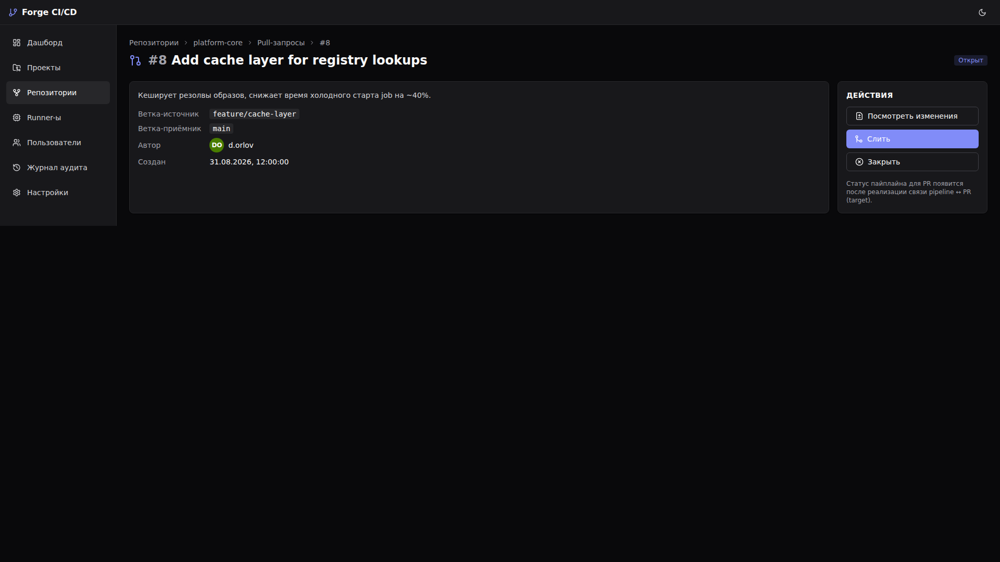

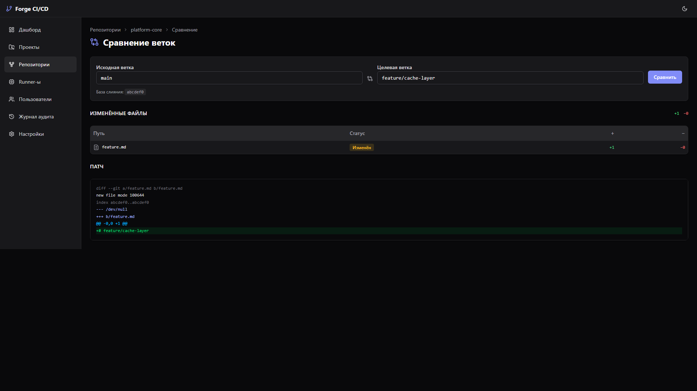

### Логи джоба

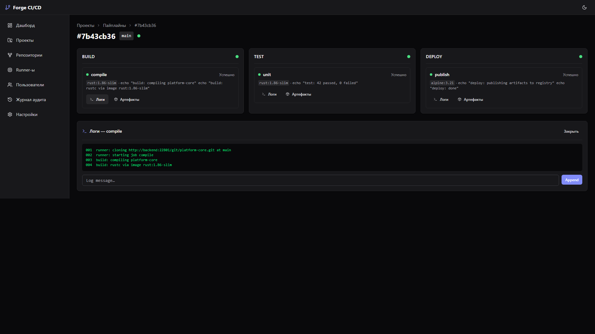

## 6. Секреты

**Статус процедуры: Current verified.**

Секреты проекта хранятся в PostgreSQL, зашифрованные AES-256-GCM ключом `CICD_SECRETS_KEY`. API и UI никогда не возвращают значение секрета после сохранения.

1. Перед включением секретов сгенерируйте отдельный base64-ключ и передайте его сервису через защищённую конфигурацию: `openssl rand -base64 32`.
2. Откройте **Secrets** проекта (`/projects/{projectId}/secrets`) и добавьте пару `key`/`value` через UI. Не вводите значение в URL, repository URL, pipeline command или `.forge-ci.yml`.
3. Проверьте список: доступны только метаданные, например key и timestamps.
4. Для отзыва удалите секрет по его ID. Замена значения выполняется повторным `POST` с тем же key.

Для автоматизации используйте защищённый API-клиент, который отправляет JSON вида `{"key":"DEPLOY_TOKEN","value":"..."}` без записи значения в shell history или CI log.

Чтобы job получила секрет, объявите имя в v1 `.forge-ci.yml`:

```yaml
version: 1
jobs:
  deploy:
    commands: ["./deploy.sh"]
    secrets: [DEPLOY_TOKEN]
```

Embedded runner inject-ит только объявленные `jobs.required_secrets`. External `forge-runner` после ack lease вызывает `secrets:resolve`, получает только declared names и передаёт их в env; stdout/stderr masking остаётся best-effort. Master-key rotation, per-environment policy и full redaction во всех каналах - **Target approved**.

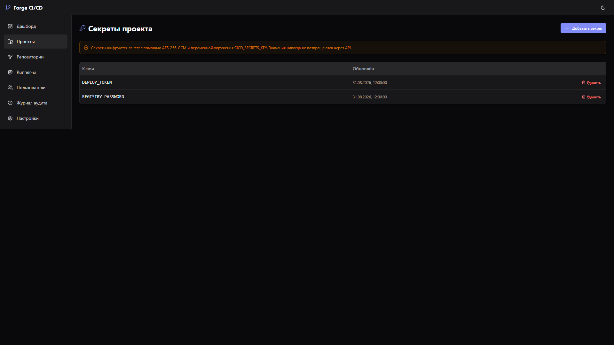

## 7. Окружения и деплои

**Статус процедуры: Current verified.**

Окружение - metadata-объект проекта с именем, URL, состоянием `available`, `stopped` или `degraded`, optional protected-флагом и числом required approvals. Запись deployment связывает окружение с `git_ref`, опционально с pipeline и статусом `pending`, `running`, `success` или `failed`.

1. Откройте **Environments** (`/projects/{projectId}/environments`).
2. Создайте окружения, например `staging` и `production`, с URL, если он известен.
3. Для обычного окружения после выполнения deploy-job добавьте запись deployment с реальным ref и статусом.
4. Для protected окружения создайте pending deployment-record, затем approve/reject сохранит append-only decision; после нужного числа approvals backend запускает связанный pipeline.
5. Для rollback нажмите **Rollback** на успешной записи: Forge создаст новую deployment запись с `rollback_of_id` и не изменит исходную историю.

> Forge не выполняет произвольную инфраструктурную оркестрацию только из создания environment/deployment. Protected approval gate и traceable rollback через pipeline уже есть как MVP; расширенные policy rules, multi-approver workflows и rollback orchestration остаются **Target approved**.

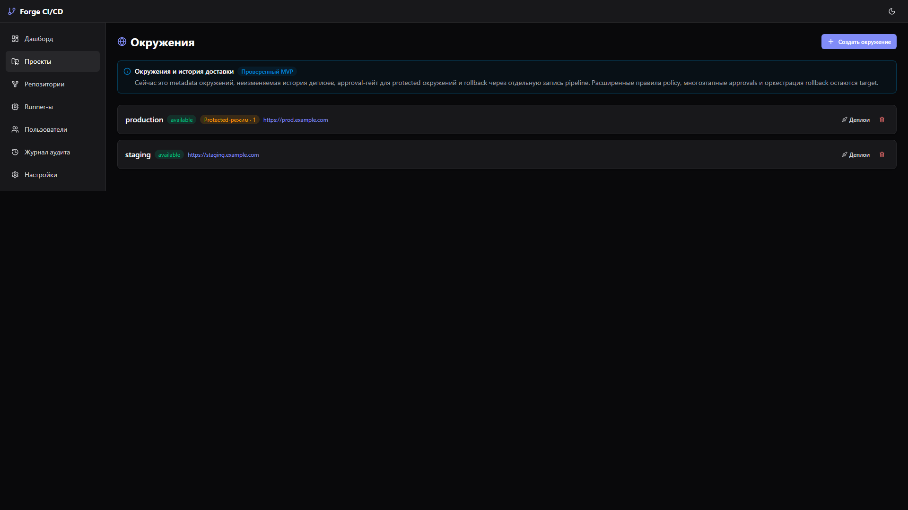

## 8. Расписания, webhooks и уведомления

### Расписания

**Статус процедуры: Current verified MVP.**

1. Откройте **Schedules** (`/projects/{projectId}/schedules`).
2. Создайте запись с пяти-польным cron-выражением, `git_ref` и флагом enabled, например `0 2 * * *` для `main`.
3. Редактируйте, отключайте или удаляйте запись при изменении политики запуска.
4. Scheduler хранит ближайший UTC `next_fire_at`, создаёт уникальный fire-slot и запускает pipeline для наступившего slot через idempotency key.
5. Если в строке показана ошибка, исправьте cron/ref через обновление расписания: `PATCH` очищает ошибку и пересчитывает `next_fire_at`.
6. IANA timezone, DST/misfire policy и multi-replica leases остаются target; текущие cron-времена интерпретируются как UTC.

### Исходящие webhooks

**Статус процедуры: Current verified MVP.**

1. Откройте **Webhooks** (`/projects/{projectId}/webhooks`).
2. Укажите HTTPS URL получателя, список событий и enabled.
3. Сохраните конфигурацию и документируйте владельца получателя.
4. Worker создаёт outbox-message на terminal pipeline event и отправляет JSON в enabled webhook. Если задан secret, добавляется HMAC header; retry/backoff и история attempts доступны на этой же странице.
5. Failed delivery можно явно поставить в повтор кнопкой **Повторить**; backend создаёт новую generation и не переписывает исходную историю.

### Уведомления

**Статус процедуры: Current verified MVP для `in_app`/`sse`; Configuration only для Slack/email.**

1. На странице **Webhooks** добавьте канал `in_app` с target `dashboard` или канал `sse` с понятным target.
2. Завершите pipeline в `success`, `failed` или `canceled`.
3. Проверьте историю уведомлений в таблице на странице **Webhooks** или через `GET /api/v1/projects/{project_id}/notification-events`.
4. Не ожидайте email или Slack-сообщение: внешние adapters ещё не реализованы.

Входящие webhooks от GitHub/GitLab/Gitea также являются **Target approved**; текущий Git auto-trigger работает через локальный `post-receive` hook, а не через public inbound webhook.

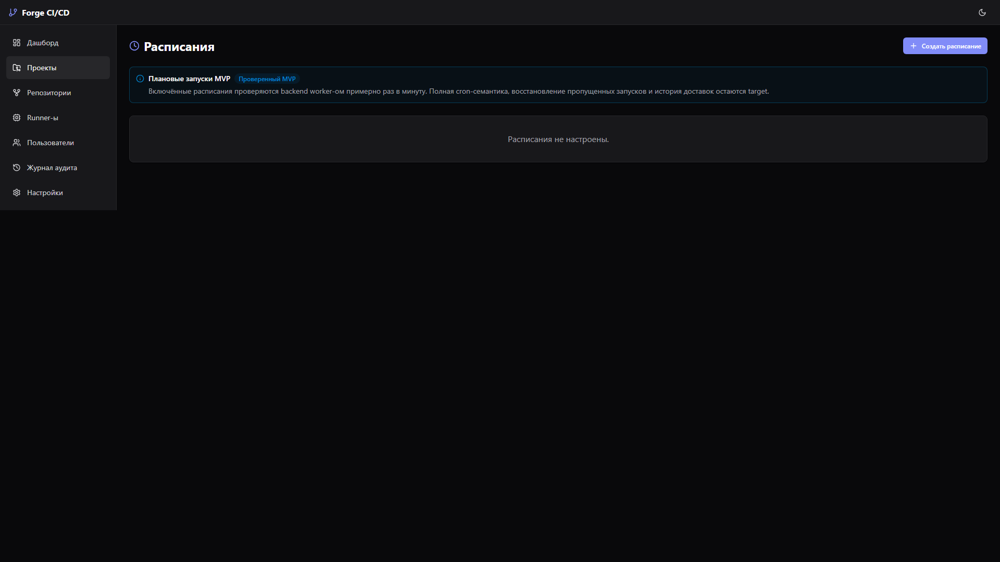

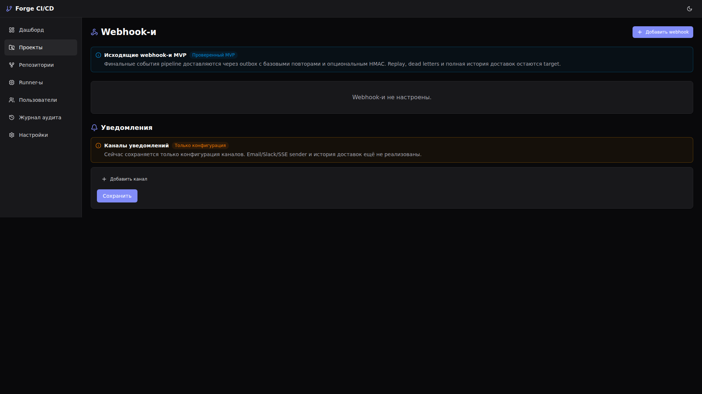

## 9. Отчёты

**Статус процедуры: Current verified.**

1. Откройте **Reports** проекта (`/projects/{projectId}/reports`).
2. Просмотрите total, successful, failed, success rate и average duration.
3. Используйте отчёт для быстрой оценки проекта; исходные данные - завершённые pipelines проекта.
4. Получите те же данные программно: `GET /api/v1/projects/{project_id}/reports/summary`.

Фильтры периода, графики, percentiles, failure trends, DORA-агрегаты и export - **Target approved**. Не интерпретируйте текущую summary как отчёт за выбранный период: такого фильтра ещё нет.

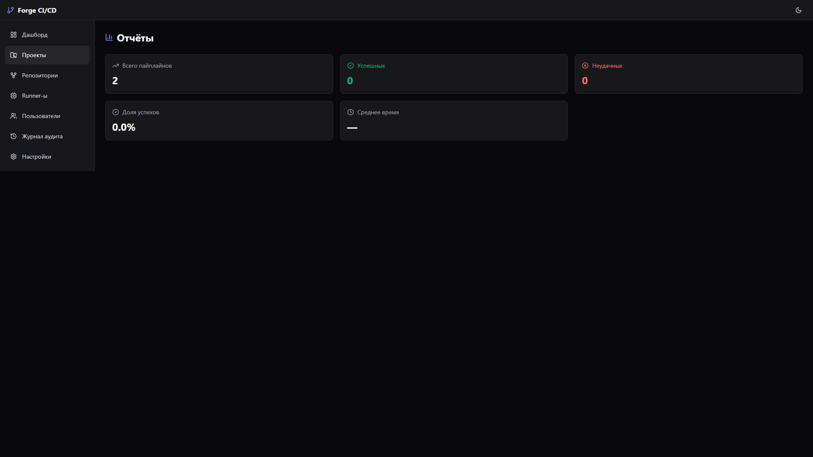

## 10. Аудит

**Статус процедуры: Current verified.**

1. Откройте **Audit log** (`/audit-log`).
2. Найдите действие по времени, actor, resource и action.
3. Для интеграции запросите `GET /api/v1/audit-log`; API возвращает не более последних 200 событий.
4. Сохраняйте критичные расследования вне Forge, если нужен срок хранения или экспорт больше встроенного окна.

Аудит append-only для текущих mutation-операций, включая runner, secret, artifact и token. Полный authorisation context, фильтры, pagination и export - **Target approved**. Он не заменяет delivery history webhooks; execution attempts смотрите в деталях job и через attempts API.

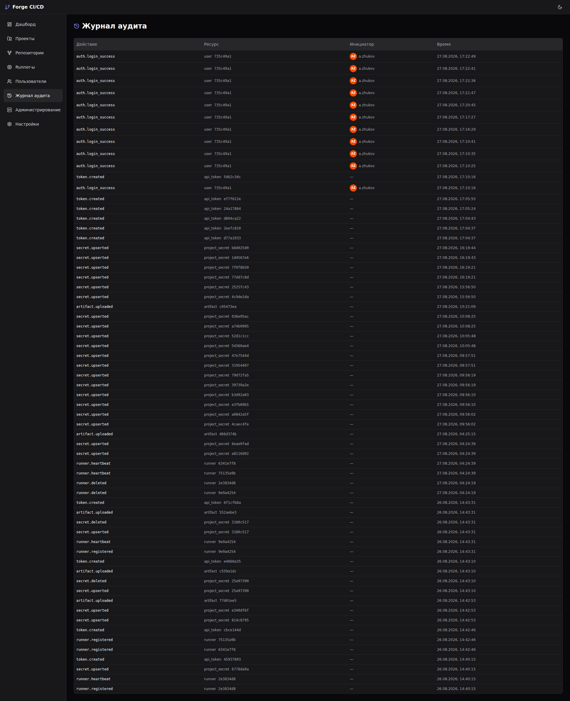

## 11. Пользователи и API-токены

### Пользователи и роли

**Статус процедуры: Current verified.**

1. Откройте **Users** (`/users`).
2. Создайте или измените пользователя с username, ролью `admin`, `maintainer`, `developer` или `viewer` и флагом enabled.
3. Используйте данные как подготовку к будущей policy-модели.
4. Роль ограничивает API только когда backend запущен с `CICD_AUTH_SECRET`; без него действует trusted-network режим.

Пароли хранятся как `argon2id` credentials. Project membership, scoped PAT, session-bound access invalidation и refresh logout/revoke уже используются при включённом `CICD_AUTH_SECRET`; tenant boundary, service-account tokens и production cookie/CSRF/session-family policy относятся к **Target approved**.

### API-токены

**Статус процедуры: Current verified.**

1. На странице **Users** создайте токен, укажите понятное имя, проект, срок действия и нужные scopes.
2. Скопируйте значение немедленно в password manager или secret manager: API показывает полное значение только один раз.
3. Для REST-клиентов выдавайте `api:read` и только при необходимости `api:write`; для Git clone/fetch нужен `git:read`, для push — `git:write`.
4. В дальнейшем сверяйте только hint, project binding, scopes, expiry и last-used в списке токенов.
5. Отзовите токен через UI или `DELETE /api/v1/api-tokens/{token_id}`, если владелец/интеграция больше не нуждается в нём.

Токены хранятся как SHA-256 hash и проверяются как Bearer PAT только при включённом `CICD_AUTH_SECRET`. Новые PAT в auth-mode обязаны иметь `project_id`, scopes и expiry; старые записи без `project_id` остаются legacy global до отзыва. Pepper/HMAC storage, service-account tokens, rotation policy и tenant permissions - **Target approved**.

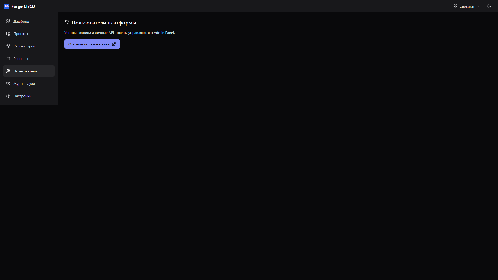

## 12. CLI-команды

**Статус процедуры: Current verified.**

CLI `cicd-cli` работает только через HTTP API и покрывает основные runtime и platform операции: projects, pipelines, jobs/logs/attempts, runners, secrets, artifacts, environments/deployments, schedules, webhooks/outbox, notifications, reports, audit, users, project members и API tokens. Соберите его из корня репозитория, если binary ещё отсутствует:

```bash
docker run --rm --entrypoint /bin/bash -v "$PWD/backend:/workspace" -w /workspace \
  -e CARGO_TARGET_DIR=/workspace/target rust:1.86-bookworm \
  -lc '/usr/local/cargo/bin/cargo build -p cicd-cli'

export CICD_API_URL=http://127.0.0.1:22801
export CICD_API_TOKEN="$TOKEN"   # нужен только при включённом CICD_AUTH_SECRET
export CICD_CLI="$PWD/backend/target/debug/cicd-cli"
```

| Задача | Команда |
|---|---|
| Список проектов | `$CICD_CLI project list --limit 50 --offset 0` |
| Создать проект | `$CICD_CLI project create --name my-service --repository-url http://127.0.0.1:22802/git/my-service.git --branch main` |
| Список запусков | `$CICD_CLI pipeline list --project <PROJECT_UUID> --limit 50 --offset 0` |
| Запустить pipeline | `$CICD_CLI pipeline run --project <PROJECT_UUID> --git-ref main` |
| Детали pipeline | `$CICD_CLI pipeline show --id <PIPELINE_UUID>` |
| Запустить job | `$CICD_CLI job start --id <JOB_UUID>` |
| Завершить job успешно | `$CICD_CLI job pass --id <JOB_UUID>` |
| Пометить job ошибочной | `$CICD_CLI job fail --id <JOB_UUID>` |
| История попыток job | `$CICD_CLI job attempts --id <JOB_UUID>` |
| Прочитать логи | `$CICD_CLI job logs --id <JOB_UUID>` |
| Прочитать логи attempt | `$CICD_CLI job logs --id <JOB_UUID> --attempt <ATTEMPT_UUID>` |
| Добавить строку лога | `$CICD_CLI job log --id <JOB_UUID> --message 'diagnostic line'` |
| Runner-ы | `$CICD_CLI runner list`; `$CICD_CLI runner register --name shell-01 --tag shell` |
| Секреты | `$CICD_CLI secret list --project <PROJECT_UUID>`; `$CICD_CLI secret set --project <PROJECT_UUID> --key NPM_TOKEN --value "$NPM_TOKEN"` |
| Артефакты | `$CICD_CLI artifact list --job <JOB_UUID>`; `$CICD_CLI artifact upload --job <JOB_UUID> --file ./build.zip --name build.zip` |
| Окружения и deployments | `$CICD_CLI environment create --project <PROJECT_UUID> --name production --protected --required-approvals 1`; `$CICD_CLI deployment approve --id <DEPLOYMENT_UUID>`; `$CICD_CLI deployment rollback --id <DEPLOYMENT_UUID>` |
| Schedules | `$CICD_CLI schedule create --project <PROJECT_UUID> --cron "0 2 * * *" --git-ref main --enabled true` |
| Webhooks/outbox | `$CICD_CLI webhook create --project <PROJECT_UUID> --url https://example.com/hook --event pipeline.finished`; `$CICD_CLI outbox requeue --id <DELIVERY_UUID>` |
| Notifications | `$CICD_CLI notification replace --project <PROJECT_UUID> --config in_app=dashboard`; `$CICD_CLI notification events --project <PROJECT_UUID> --limit 50` |
| Reports/audit | `$CICD_CLI report summary --project <PROJECT_UUID>`; `$CICD_CLI audit list` |
| Users/members/tokens | `$CICD_CLI user list`; `$CICD_CLI member upsert --project <PROJECT_UUID> --user <USER_UUID> --role developer`; `$CICD_CLI token create --name deploy-bot --user <USER_UUID> --project <PROJECT_UUID> --scope api:read --expires-in-days 30` |

Глобальные флаги `--token`, `--output json|table`, `--api-url` и env-переменные `CICD_API_TOKEN`, `CICD_OUTPUT`, `CICD_API_URL` описаны в [CLI](CLI.md). CLI profile/keyring, shell completion, YAML/NDJSON и полноценный real-API CLI integration gate остаются **Target approved**.

## 13. FAQ по типовым задачам

### Как вручную запустить pipeline для ветки?

**Статус процедуры: Current verified.**

Откройте pipelines проекта, выберите **Run pipeline** и укажите ref; либо выполните:

```bash
curl -fsS -X POST "http://127.0.0.1:22801/api/v1/projects/$PROJECT_ID/pipelines" \
  -H 'content-type: application/json' \
  -H "Idempotency-Key: $(uuidgen)" \
  -d '{"git_ref":"main"}'
```

### Почему после push нет pipeline?

**Статус процедуры: Current verified.**

Проверьте по порядку:

1. Репозиторий создан Forge и URL push имеет вид `/git/<name>.git`.
2. У проекта `repository_url` оканчивается на тот же `<name>.git`.
3. Backend доступен и hook имеет корректный `CICD_GIT_INTERNAL_TOKEN`.
4. Push прошёл успешно; hook best-effort и не прерывает операцию при сбое доставки.

Для внешних Git-провайдеров настройка incoming webhooks пока не является альтернативой: она **Target approved**.

### Как отменить зависший pipeline или повторить неудачный?

**Статус процедуры: Current verified.**

В деталях pipeline используйте **Cancel** для каскадной отмены нетерминальных jobs или **Retry** для нового запуска того же project/ref. Отдельную terminal job можно повторить её кнопкой **Retry**. Secret injection работает через declared `jobs.*.secrets`: embedded runner inject-ит только объявленные project secrets, а current `forge-runner` shell MVP после `ack` получает lease-scoped secret bundle, передаёт его в env, маскирует stdout/stderr и отправляет terminal completion. Declared artifact upload работает через `jobs.*.artifacts.paths`: runner собирает workspace-relative файлы, сохраняет metadata с attempt и показывает их на странице job artifacts. Richer log chunks, resumable artifact sessions и production sandbox остаются target.

### Где найти логи и почему они не меняются?

**Статус процедуры: Current verified.**

Откройте job и **Logs** или вызовите `GET /api/v1/jobs/{job_id}/attempts` вместе с `/attempts/{attempt_id}/logs`. Логи append-only в рамках выбранной attempt; у queued job может ещё не быть строк. Если после retry shortcut `/logs` показывает пустой текущий запуск, переключитесь на предыдущую attempt для старой диагностики и проверьте status job, image, command и доступность Docker/host shell для embedded runner. Для external `forge-runner` current MVP уже отправляет stdout/stderr в централизованные logs через runner protocol, резолвит declared secrets отдельным lease-scoped endpoint и загружает declared artifacts через lease-scoped endpoint; richer chunk/idempotency и resumable artifact sessions остаются target.

### Как безопасно передать credential в job?

**Статус процедуры: Current verified for embedded and external runner MVP.**

Сохраните secret в разделе **Secrets** проекта и обращайтесь к нему из command как к env-переменной с тем же key. Не помещайте credential в `.forge-ci.yml`, URL репозитория или логи; masking — best-effort и не является полноценной DLP-системой.

### Можно ли запланировать ночной запуск или получить Slack-уведомление?

**Статус процедуры: Current verified MVP для schedule и `in_app`/`sse`; Configuration only для Slack/email.**

Ночной запуск можно настроить как MVP schedule: backend считает строгий 5-польный UTC cron, хранит `next_fire_at` и создаёт уникальный fire-slot; IANA timezone/DST/misfire остаются target. `in_app`/`sse` уведомления по terminal pipeline events видны в Dashboard/API. Slack/email-уведомление можно только сохранить как конфигурацию; внешний sender ещё не реализован.

### Почему роль пользователя или API-токен не запрещают доступ?

**Статус процедуры: Current verified.**

Проверьте, задан ли непустой `CICD_AUTH_SECRET`. Без него API и Dashboard намеренно работают в trusted-network режиме; с ним JWT/scoped PAT, глобальные роли, project memberships и Git Smart HTTP read/write checks применяются middleware. Tenant isolation, service-account tokens и scoped Git credentials пока target, поэтому shared-доступ всё равно закрывайте reverse proxy/сетью.

## Связанные документы

- `docs/CURRENT_STATE.md` - проверенная карта возможностей и ограничений.
- `docs/API.md` - точные HTTP endpoints, запросы и ответы.
- `docs/GIT_HOSTING.md` - Smart HTTP, post-receive hook и защита Git-трафика.
- `docs/ENV.md` - переменные окружения и генерация ключей.
- `docs/contracts/PIPELINE_DSL.md` - нормативный target-контракт DSL.
- `docs/AUTHORIZATION.md` - target auth/RBAC policy.
