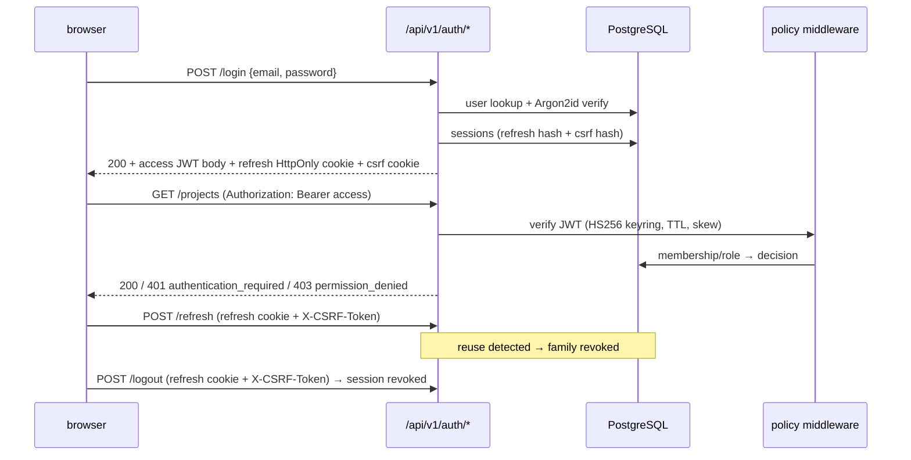

# Sequence: auth session (target)

Контракты: `contracts/AUTHZ_CONTRACT.md` + `AUTH_IMPLEMENTATION_SPEC.md`. Текущий MVP уже реализует conditional `/auth/login`, `/auth/refresh`, `/auth/logout`, browser refresh cookie + CSRF, session-bound access invalidation и project membership checks при заданном `CICD_AUTH_SECRET`; tenant isolation и refresh-family reuse policy остаются целевым расширением.
