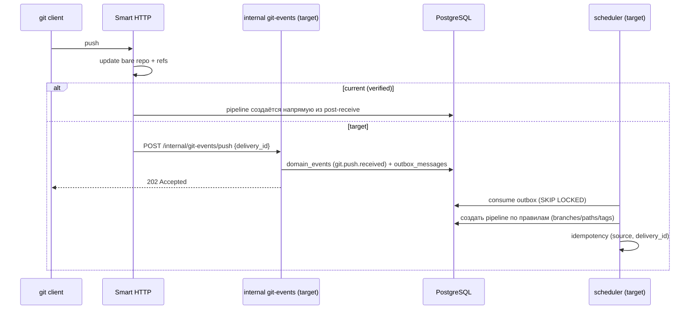

# Sequence: Git ingress и события

```mermaid
sequenceDiagram
    participant G as git client
    participant API as Smart HTTP
    participant INT as internal git-events (target)
    participant DB as PostgreSQL
    participant SC as scheduler (target)

    G->>API: push
    API->>API: update bare repo + refs
    alt current (verified)
        API->>DB: pipeline создаётся напрямую из post-receive
    else target
        API->>INT: POST /internal/git-events/push {delivery_id}
        INT->>DB: domain_events (git.push.received) + outbox_messages
        INT-->>G: 202 Accepted
        SC->>DB: consume outbox (SKIP LOCKED)
        SC->>DB: создать pipeline по правилам (branches/paths/tags)
        SC->>SC: idempotency (source, delivery_id)
    end
```

Legacy `POST /api/v1/internal/git-push` существует; замена — `transition-map.md`.
