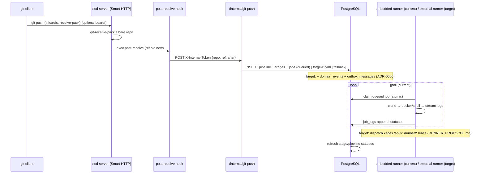

# Sequence: Git push → pipeline trigger

```mermaid
sequenceDiagram
    participant G as git client
    participant API as cicd-server (Smart HTTP)
    participant H as post-receive hook
    participant INT as /internal/git-push
    participant DB as PostgreSQL
    participant R as embedded runner (current) / external runner (target)

    G->>API: git push (info/refs, receive-pack) [optional bearer]
    API->>API: git-receive-pack в bare repo
    API->>H: exec post-receive (ref old new)
    H->>INT: POST X-Internal-Token {repo, ref, after}
    INT->>DB: INSERT pipeline + stages + jobs (queued) [.forge-ci.yml | fallback]
    Note over DB: target: + domain_events + outbox_messages (ADR-0006)
    loop poll (current)
        R->>DB: claim queued job (atomic)
        R->>R: clone → docker/shell → stream logs
        R->>DB: job_logs append, statuses
    end
    Note over R: target: dispatch через /api/v1/runner/* lease (RUNNER_PROTOCOL.md)
    DB->>DB: refresh stage/pipeline statuses
```

Текущий флоу — verified; блоки `target:` — approved, не реализованы.
