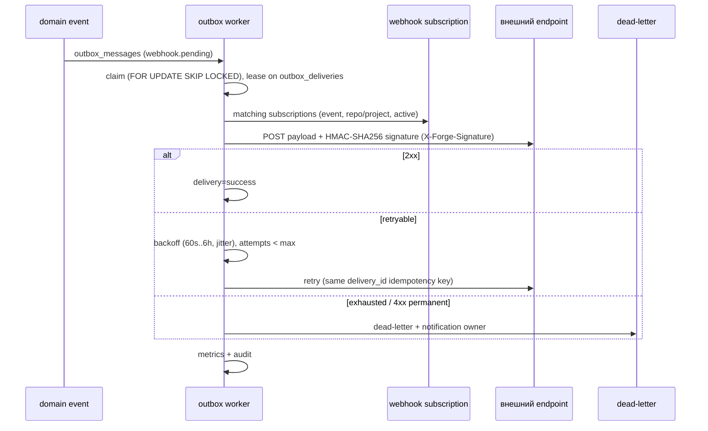

# Sequence: webhook delivery (target)

Контракты: `contracts/EVENT_CONTRACT.md`. Сейчас реализован bounded MVP: terminal pipeline events создают `domain_events`/`outbox_messages`, worker делает webhook retry/HMAC, фиксирует attempts и позволяет requeue failed delivery; diagram выше описывает target-добавки leases/reconciliation/full dead-letter.
