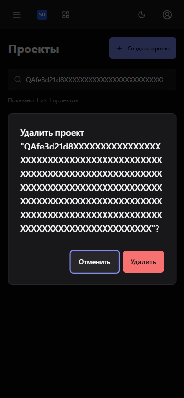
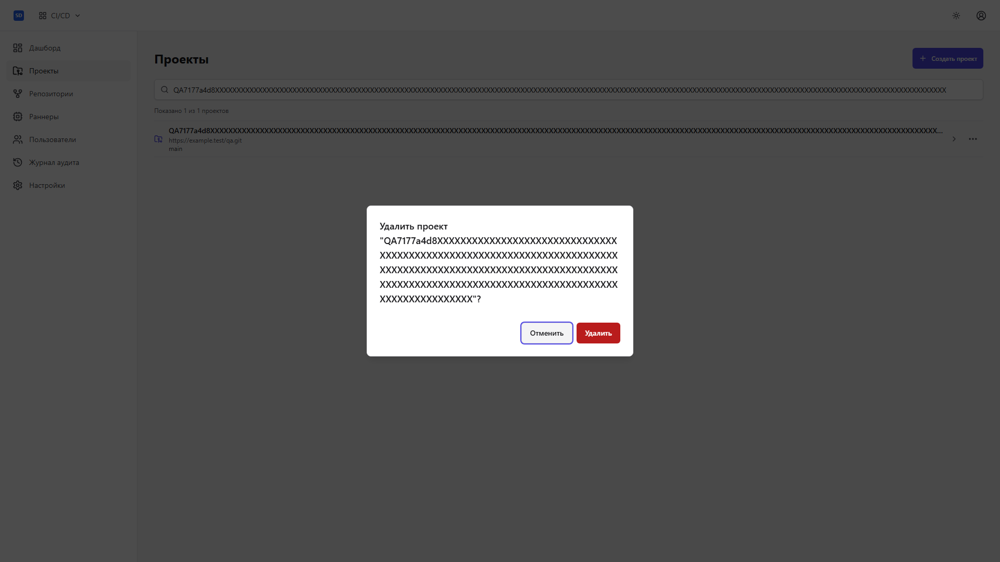
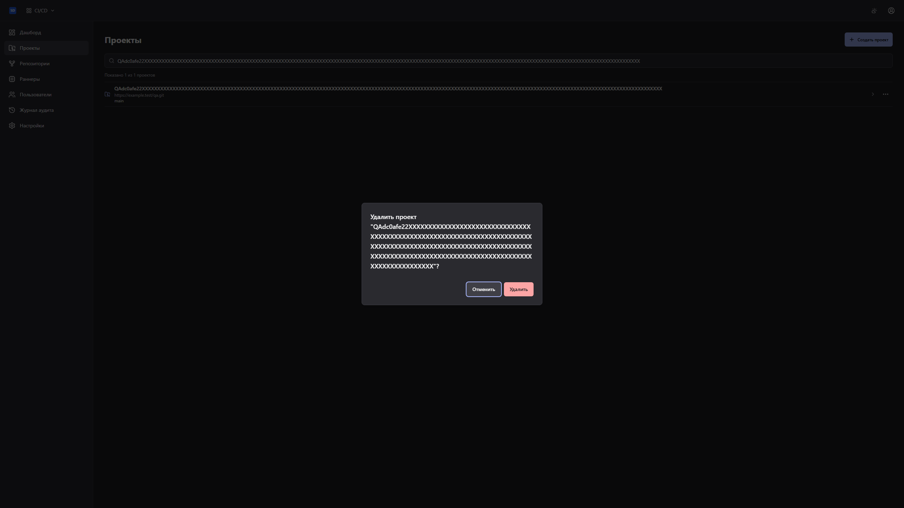

# Диалог удаления проекта: focus и адаптивность

Живой браузерный QA от 2026-10-04: 23/23 сценария прошли на production-образе.
CI/CD проверен на 375, 768, 1440, 1920 и 2560 px в dark, gray и light;
Wiki — на 375 и 1440 px в тех же темах. Проверены начальный focus, Tab,
Escape, отмена, возврат к меню проекта и устойчивый focus кнопки создания
после успешного удаления с обновлением списка.

Pending воспроизведён блокировкой созданной строки PostgreSQL. Проверены
блокировка повторного подтверждения/отмены/Escape, реальная ошибка 404,
отображение ошибки и повторная попытка. Использованы настоящие Central Auth,
API и PostgreSQL во временном Compose; подмена запросов не применялась.
На снимках только собственные тестовые проекты с длинным названием.

Источник UI: `3a6f7067fa1cc96fb830160862fb32cc71ed8c71`. Base: `9408802dfa978cba2f67162a49adca6f65851b01`.
Playwright: `1.62.1`. Изображения открыты и проверены.
Это свидетельство UI-проверки, полную приёмку всей платформы оно не заменяет.

Регрессии потребителя: `frontend/src/pages/projects/projects.test.tsx`;
`pnpm --dir frontend exec vitest run src/pages/projects/projects.test.tsx`.
Полный frontend: 199 tests, lint, build и OpenAPI drift/compatibility PASS.

